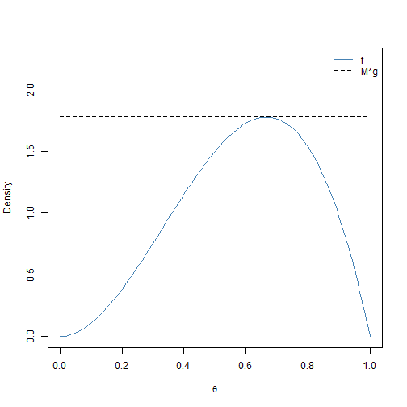
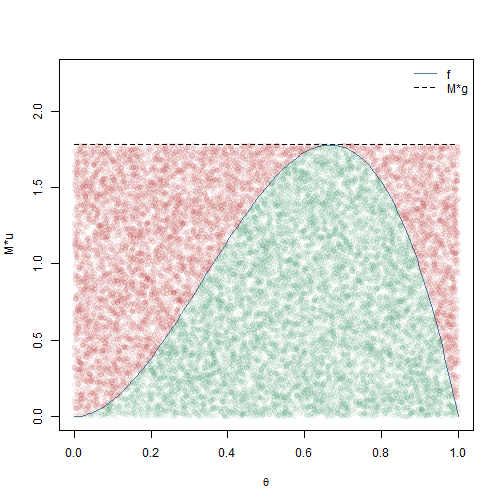
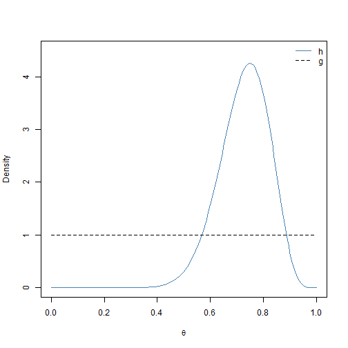
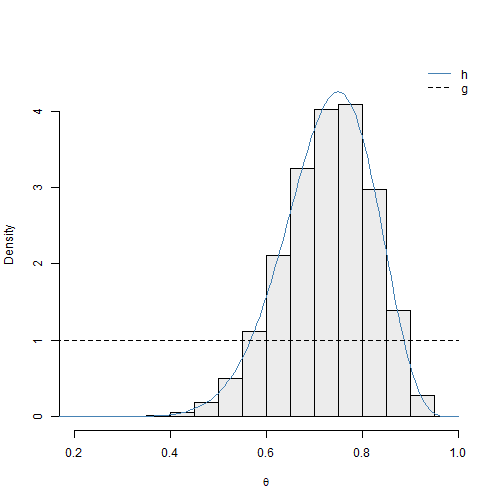
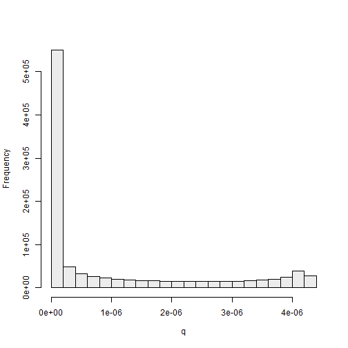
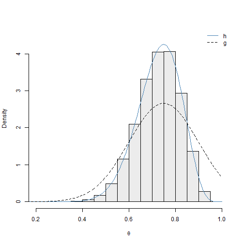
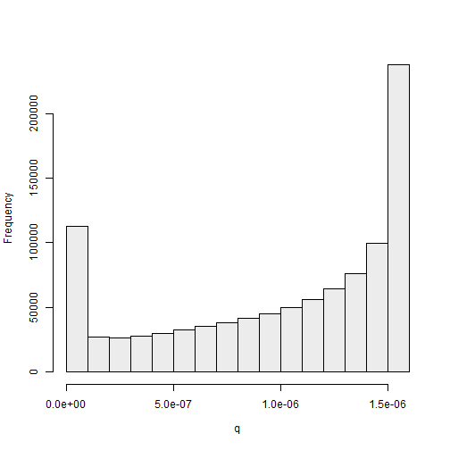
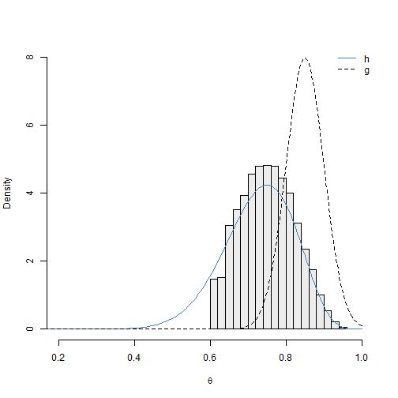
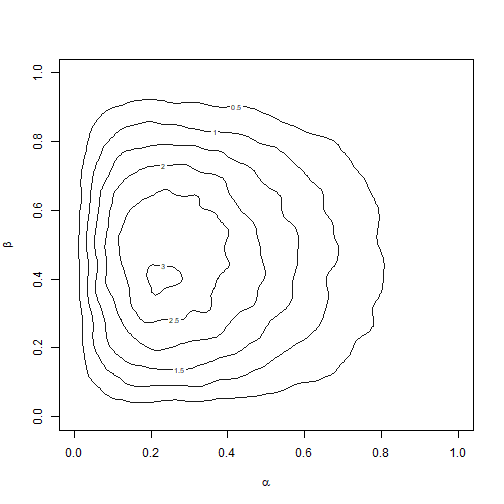

# Sampling-Resampling Methods {#chapter2}


\newpage
\setstretch{1.05}

*Luke Hagar*

## Introduction

Welcome to the first workshop for the Statistical Workshops and Applications Group (SWAG)! This workshop discusses sampling-resampling methods, mainly in the context of Bayesian inference.

## Rejection Sampling

Before introducing sampling-resampling methods, we briefly discuss rejection sampling [@ripley2009stochastic] along with its strengths and shortcomings. In what follows, we discuss the set up for our sampling scenario.

  * Let's suppose we can easily generate a sample from a continuous density function $g(\boldsymbol{\theta})$. We call this the proposal distribution.
  * However, we want a sample from a density $h(\boldsymbol{\theta})$ such that $g(\boldsymbol{\theta}) = 0$ implies $h(\boldsymbol{\theta}) = 0$ for all $\boldsymbol{\theta} \in \boldsymbol{\Theta}$.
  * We have a positive function $f(\boldsymbol{\theta})$ that is proportional to $h(\boldsymbol{\theta})$. That is, $h(\boldsymbol{\theta}) = f(\boldsymbol{\theta})/\int f(\boldsymbol{\theta})d\boldsymbol{\theta}$.
  * For rejection sampling, we further suppose that there exists an identifiable constant $M > 0$ such that $f(\boldsymbol{\theta})/g(\boldsymbol{\theta}) \le M$ for all $\boldsymbol{\theta} \in \boldsymbol{\Theta}$.

Let's reinforce this terminology with an example. In this example, we want to sample from $h(\theta) = 12\theta^2(1-\theta)$ for $0 < \theta < 1$. This is actually a $\text{BETA}(3,2)$ distribution. For this example, we let $f(\theta) = h(\theta)$. We have that $f(\theta) \le 16/9$ for all $0 < \theta < 1$. We can easily sample over the unit interval using the uniform density $U(0,1)$. This corresponds to choosing $g(\theta) = 1$ for $0 < \theta < 1$. It follows that $f(\boldsymbol{\theta})/g(\boldsymbol{\theta}) \le 16/9 = M$ for all $0 < \theta < 1$. This scenario is visualized in Figure 2.1.    


```r
## compute f and g across the range of theta for plotting purposes
theta <- seq(0, 1, by = 0.005)
f <- 12 * theta^2 * (1 - theta)
g <- rep(1, length(theta))
M <- 16/9

## generate the plot and corresponding legend
plot(theta, f, col = "steelblue", type = "l", ylab = "Density", ylim = c(0, 
    2.25), xlab = expression(theta))
lines(theta, M * g, lty = 2)
legend("topright", c("f", "M*g"), col = c("steelblue", "black"), lty = c(1, 
    2), bty = "n")
```
<figure>

<figcaption><div style="text-align: center; width: 100%;">Figure 2.1: Visualization of rejection sampling functions</div></figcaption>
</figure>

<br>

We now introduce rejection sampling. This process is detailed in Algorithm 1. A sample of $\boldsymbol{\theta}$ values accepted via Algorithm 1 is a sample from the density of interest $h(\boldsymbol{\theta})$ [@ripley2009stochastic].

**Algorithm 1**

1. Generate $\boldsymbol{\theta}$ from $g(\boldsymbol{\theta})$.
2. Generate $u \sim U(0,1)$.
3. If $u \le f(\boldsymbol{\theta})/(Mg(\boldsymbol{\theta}))$, return $\boldsymbol{\theta}$; otherwise return to Step 1.

We now illustrate how to implement rejection sampling to generate 10000 observations from $h(\boldsymbol{\theta})$ for this simple example. The results are visualized in Figure 2.2.


```r
## initialize matrices for accepted and rejected theta values
accept_mat <- NULL
reject_mat <- NULL

## set seed for reproducibility
set.seed(1)

stop <- FALSE
## continue until 10000 points are accepted
while (stop == FALSE) {
    ## generate a value from g: U(0,1)
    theta_temp <- runif(1)

    ## generate u to decide whether to accept/reject
    u <- runif(1)

    ## compute the values for f and g at this theta value
    f_temp <- 12 * theta_temp^2 * (1 - theta_temp)
    g_temp <- 1

    ## decide whether or not to accept point; we save the rejected
    ## points and 'u' realizations for the plot
    if (u <= f_temp/(M * g_temp)) {
        accept_mat <- rbind(accept_mat, c(theta_temp, u))
        if (nrow(accept_mat) >= 10000) {
            stop <- TRUE
        }
    } else {
        reject_mat <- rbind(reject_mat, c(theta_temp, u))
    }
}

## generate the plot and corresponding legend green points represent
## accepted (theta, u) combinations red points represent rejected
## (theta, u) combinations
plot(theta, f, col = "steelblue", type = "l", ylab = "M*u", ylim = c(0, 
    2.25), xlab = expression(theta), lwd = 1.5)
lines(theta, M * g, lty = 2, lwd = 1.5)
legend("topright", c("f", "M*g"), col = c("steelblue", "black"), lty = c(1, 
    2), bty = "n")
points(accept_mat[, 1], M * accept_mat[, 2], col = adjustcolor("seagreen", 
    0.05), pch = 19)
points(reject_mat[, 1], M * reject_mat[, 2], col = adjustcolor("firebrick", 
    0.05), pch = 19)
```

<figure>

<figcaption><div style="text-align: center; width: 100%;">Figure 2.2: Visualization of rejection sampling with accepted points (green) and rejected points (red)</div></figcaption>
</figure>

<br>

The points in Figure 2.2 depict which $\theta$ values were accepted (green) and rejected (red) by rejection sampling. The resulting sample appears to come from the $\text{BETA}(3,2)$ distribution. We make two final remarks about rejection sampling that bear relevance to sampling-resampling methods. 

  1. To implement rejection sampling, we *must* identify a constant $M > 0$ such that $f(\boldsymbol{\theta})/g(\boldsymbol{\theta}) \le M$ for all $\boldsymbol{\theta} \in \boldsymbol{\Theta}$. This choice for $M$ is important.
      + For this example, we could have chosen $M > 16/9$, but the sampling procedure would have been less efficient.
      + Choosing $M < 16/9$ would have returned a sample that is not from the $\text{BETA}(3,2)$ distribution.
  2. We need to carefully consider the support of $h(\boldsymbol{\theta})$ and $g(\boldsymbol{\theta})$.
      + Choosing $g(\boldsymbol{\theta})$ to be $U(0.25, 0.75)$ would not have been appropriate for this example.
      + Choosing $g(\boldsymbol{\theta})$ to be $U(-1, 1)$ would be fine but less efficient.
      
When using sampling-resampling methods, remark 1 is often not of concern.

## Sampling-Resampling Methods

### Overview of the Sampling-Importance-Resampling Algorithm

We now discuss how to obtain an approximate sample from the density $h(\boldsymbol{\theta})$ using a particular weighted sampling-resampling method, which is a variant of the bootstrap procedure [@efron1982jackknife]. This method was first formally proposed in @rubin1987calculation and @rubin1988using as the sampling-importance-resampling (SIR) algorithm. We introduce this procedure via Algorithm 2, which uses notation from @smith1992bayesian. 

**Algorithm 2**

1. Generate $\boldsymbol{\theta}_i, ~ i = 1,...,n$ from $g(\boldsymbol{\theta})$.
2. For each $\boldsymbol{\theta}_i$, compute $\omega_i = f(\boldsymbol{\theta}_i)/g(\boldsymbol{\theta_i})$.
3. Let $q_i = \omega_i/\sum_{j=1}^n\omega_j$ for $i = 1,...,n$.
4. Draw $\{\boldsymbol{\theta}^*_1,..., \boldsymbol{\theta}^*_m\}$ from the discrete distribution over $\{\boldsymbol{\theta}_1, ..., \boldsymbol{\theta}_n \}$ with replacement, where mass $q_i$ is placed on $\boldsymbol{\theta}_i$.


Under several conditions, $\boldsymbol{\theta}^*$ is approximately distributed according to $h(\boldsymbol{\theta})$. Algorithm 2 returns approximate samples from $h(\boldsymbol{\theta})$ when $n$ is sufficiently large and $supp(h) \subseteq supp(g)$, where $supp()$ refers to the support of a probability distribution. How large $n$ must be depends on the extent to which $h(\boldsymbol{\theta})$ resembles $g(\boldsymbol{\theta})$. Moreover, $m$ is typically smaller than $n$; @rubin1987calculation stated that specifying $m$ and $n$ such that their ratio $n/m$ is at least 20 should be sufficient in most scenarios.

When implementing this sampling-resampling procedure, we must still be mindful of the supports of $h(\boldsymbol{\theta})$ and $g(\boldsymbol{\theta})$. However, we do not need to identify a constant $M > 0$ such that $f(\boldsymbol{\theta})/g(\boldsymbol{\theta}) \le M$ for all $\boldsymbol{\theta} \in \boldsymbol{\Theta}$. We only require a function $g(\boldsymbol{\theta})$ that we can readily sample from and a function $f(\boldsymbol{\theta})$ that is proportional to our density of interest $h(\boldsymbol{\theta})$.

For Bayesian inference, we often want to sample from a posterior distribution of interest $\pi(\boldsymbol{\theta}| \boldsymbol{x})$ for $\boldsymbol{\theta}$ given observed data $\boldsymbol{x}$. Let $L()$ be the likelihood function and $p()$ be the prior for $\boldsymbol{\theta}$. The posterior distribution communicates which values $\boldsymbol{\theta}$ are plausible given the observed data and our prior beliefs. By Bayes' Theorem, we have that
$$\pi(\boldsymbol{\theta}| \boldsymbol{x}) = \frac{L(\boldsymbol{\theta}; \boldsymbol{x})p(\boldsymbol{\theta})}{\int L(\boldsymbol{\theta}; \boldsymbol{x})p(\boldsymbol{\theta})d\boldsymbol{\theta}} \propto L(\boldsymbol{\theta}; \boldsymbol{x})p(\boldsymbol{\theta}).$$

Thus, we have $h(\boldsymbol{\theta}) = \pi(\boldsymbol{\theta}| \boldsymbol{x})$ and $f(\boldsymbol{\theta}) = L(\boldsymbol{\theta}; \boldsymbol{x})p(\boldsymbol{\theta})$ using the notation from earlier. For a given $\boldsymbol{\theta}$ value, it is straightforward to compute $f(\boldsymbol{\theta})$; however, we are often not able to compute $h(\boldsymbol{\theta})$ directly. As such, the SIR algorithm goes well with the framework for Bayesian inference. It can be used to generate an approximate sample from the posterior distribution of interest $h(\boldsymbol{\theta}) = \pi(\boldsymbol{\theta}| \boldsymbol{x})$ and serves as an alternative to more standard Markov chain Monte Carlo (MCMC) methods in many scenarios. The SIR algorithm can be used with non-Bayesian methods, but the remainder of this workshop focuses on implementing the SIR algorithm to conduct approximate posterior sampling.  

### Computational Considerations

The SIR algorithm often produces more stable results when $\omega_i, i = 1,...,n$ are computed on the logarithmic scale. This is consistent with other methods for Bayesian inference that do not involve sampling-resampling. Particularly when $\boldsymbol{\theta}$ is multivariate, $f(\boldsymbol{\theta})$ and $g(\boldsymbol{\theta})$ can take small positive values that are extremely close to 0. Computing $\text{log}(\omega_i)$ helps make underflow errors less common, as we will see shortly. We have that
$$\text{log}(\omega_i) = \text{log}(f(\boldsymbol{\theta}_i)) - \text{log}(g(\boldsymbol{\theta}_i)).$$
In the context of Bayesian inference, $f(\boldsymbol{\theta}) = L(\boldsymbol{\theta}; \boldsymbol{x})p(\boldsymbol{\theta})$ is generally the product of several terms, so $\text{log}(f(\boldsymbol{\theta}_i))$ is often easier to manipulate than $f(\boldsymbol{\theta}_i)$. When $g(\boldsymbol{\theta})$ is a well known probability distribution, we can often compute $\text{log}(g(\boldsymbol{\theta}_i))$ using built-in R functions. For instance, if $g(\boldsymbol{\theta})$ is the standard normal distribution, we can compute $\text{log}(g(\boldsymbol{\theta}_i))$ as $\texttt{dnorm(}\boldsymbol{\theta}_i\texttt{, log = TRUE)}$. 

We must then exponentiate the $\text{log}(\omega_i)$ values to compute the normalized weights $q_i, ~ i = 1, ..., n$. In certain situations, we proceed with caution to avoid more underflow errors. Let's consider the following example with only three $\text{log}(\omega_i)$ values: $\text{log}(\omega_1) = 0$, $\text{log}(\omega_2) = 1$, and $\text{log}(\omega_3) = 2$. For this example, we can exponentiate and standardize these weights without issues using the following R code.


```r
## define log weights
log_omega <- c(0, 1, 2)

## exponentiate the weights
omega <- exp(log_omega)

## standardize the weights and print results by enclosing assignment
## command with ()
(q <- omega/sum(omega))
```

```
## [1] 0.09003057 0.24472847 0.66524096
```

Here, we standardize the weights after exponentiation. That being the case, we can apply a translation to the weights on the logarithmic scale without impacting the final standardized weights. For this example, the maximum $\text{log}(\omega_i)$ is $\text{log}(\omega_3) = 2$. Let's subtract 2 from each original $\text{log}(\omega_i)$ value before exponentiation and output the results.


```r
## define log weights
log_omega <- c(0, 1, 2)

## subtract 2 from each log_omega value and exponentiate the weights
omega <- exp(log_omega - max(log_omega))

## standardize the weights
(q <- omega/sum(omega))
```

```
## [1] 0.09003057 0.24472847 0.66524096
```

The final standardized weights are the same! This trick is useful when the $\text{log}(\omega_i)$ values are very small (or very large). Let's now imagine that $\text{log}(\omega_1) = -800$, $\text{log}(\omega_2) = -799$, and $\text{log}(\omega_3) = -798$. Let's see what occurs if we try to exponentiate these values.


```r
## define log weights
log_omega <- c(-800, -799, -798)

## exponentiate the weights
(omega <- exp(log_omega))
```

```
## [1] 0 0 0
```

```r
## standardize the weights
(q <- omega/sum(omega))
```

```
## [1] NaN NaN NaN
```

This produces an underflow error. The values for $\omega_i, ~ i = 1, 2, 3$ are so small that they are rounded down to 0. But, we can apply a translation to the $\text{log}(\omega_i)$ values by subtracting $\text{max}_{i = 1, 2, 3}~\text{log}(\omega_i) = -798$ from each value. This produces the same final standardized weights as for the earlier example -- which makes sense because this example simply subtracted 800 from each of the earlier $\text{log}(\omega_i)$ values.


```r
## define log weights
log_omega <- c(-800, -799, -798)

## subtract max(log_omega) from each log_omega value and exponentiate
## the weights
omega <- exp(log_omega - max(log_omega))

## standardize the weights
(q <- omega/sum(omega))
```

```
## [1] 0.09003057 0.24472847 0.66524096
```

## Implementation of Sampling-Resampling Methods

### Illustrative Example with Binary Data

Here, we demonstrate how to implement the SIR algorithm to faciliate posterior sampling for a simple example. In this example, we assume that we observe binary data $x_1, ..., x_N$ such that $x_j \sim \text{BIN}(1, \theta)$. We assume that the prior for $\theta$ is an uninformative $\text{BETA}(1,1)$ prior, which implies that $p(\theta) = 1$ for $0 < \theta < 1$. In this case, the posterior $h(\theta) = \pi(\theta| \boldsymbol{x})$ is such that
$$h(\boldsymbol{\theta}) \propto L(\theta; \boldsymbol{x}) = \prod_{j=1}^N\theta^{x_j}(1 - \theta)^{1-x_j} = \theta^{\sum_{j=1}^Nx_j}(1-\theta)^{N-\sum_{j=1}^Nx_j} = f(\theta).$$

Let's assume that we have $N = 20$ observations and that 15 of these Bernoulli trials were successful ($\sum_{j=1}^N x_j = 15$). It follows that $f(\theta) = \theta^{15}(1-\theta)^5$ for $0 < \theta < 1$. For this example, $h(\theta)$ is actually known: it is a $\text{BETA}(16, 6)$ distribution. Therefore, we do not need to use sampling-resampling methods to sample from $h(\boldsymbol{\theta})$. However, because $h(\theta)$ is known, we can use this example to explore the performance of the SIR algorithm for different proposal distributions $g(\boldsymbol{\theta})$. The first proposal distribution that we consider is $g(\theta) = 1$ for $0 < \theta < 1$ (i.e., the $U(0,1)$ distribution). We plot $h(\theta)$ and $g(\theta)$ in Figure 2.3.


```r
## compute h and g across the range of theta for plotting purposes
theta <- seq(0, 1, by = 0.005)
h <- dbeta(theta, 16, 6)
g <- rep(1, length(theta))

## generate the plot and corresponding legend
plot(theta, h, col = "steelblue", type = "l", ylab = "Density", ylim = c(0, 
    4.5), xlab = expression(theta))
lines(theta, g, lty = 2)
legend("topright", c("h", "g"), col = c("steelblue", "black"), lty = c(1, 
    2), bty = "n")
```

<figure>

<figcaption><div style="text-align: center; width: 100%;">Figure 2.3: Visualization of posterior and uniform sampling function</div></figcaption>
</figure>

<br>

While $h(\theta)$ and $g(\theta)$ have the same support, it does not appear that $U(0,1)$ will be a very efficient proposal distribution for this example. Values of $\theta_i$ close to 0 that are generated via $g(\theta)$ will be assigned standardized weights of $q_i \approx 0$. We now show how to implement the entire SIR algorithm for this example with the uniform sampling function. We use the settings $n$ = 1 million and $m = 50000$. The results are visualized in Figure 2.4.  


```r
## input the sample of 20 observations into R
x <- c(rep(1, 15), rep(0, 5))

## extract the number of observations (N) and successes
N <- length(x)
sum_x <- sum(x)

## define SIR algorithm settings
n <- 1e+06
m <- 50000

## define a function that is proportional to the posterior (on the
## logarithmic scale)
propLog <- function(theta, obs, sum_data) {
    ## return -Inf is theta is not between 0 and 1 (this will
    ## exponentiate to give q_i = 0)
    return(ifelse(theta > 0 & theta < 1, sum_data * log(theta) + (obs - 
        sum_data) * log(1 - theta), -Inf))
}

set.seed(2)
## sample from proposal distribution
samp <- runif(n)

## form importance sampling weights on log-scale; here, log(g(theta))
## = log(1) = 0 for all 0 < theta < 1
w1 <- propLog(samp, N, sum_x) - 0
w1 <- exp(w1 - max(w1))
q1 <- w1/sum(w1)

## resample to create approximate sample from posterior
inds1 <- sample(seq(1, n, by = 1), size = m, replace = TRUE, prob = q1)
post1 <- samp[inds1]

## generate the plot and corresponding legend
hist(post1, col = adjustcolor("grey50", 0.15), main = "", freq = FALSE, 
    xlim = c(0.2, 1), xlab = expression(theta), ylab = "Density", ylim = c(0, 
        4.5))
lines(theta, h, col = "steelblue", type = "l")
lines(theta, g, lty = 2)
legend("topright", c("h", "g"), col = c("steelblue", "black"), lty = c(1, 
    2), bty = "n")
```

<figure>

<figcaption><div style="text-align: center; width: 100%;">Figure 2.4: Histogram of posterior sample 1 obtained using SIR (with densities for $h$ and $g$)</div></figcaption>
</figure>

<br>

The uniform proposal distribution appears to be serviceable for this example. The density curve for $h(\theta)$ -- which is not known exactly in most situations -- agrees well with histogram of the approximate posterior sample. However, the simulation results confirm that this distribution is not very efficient. The histogram of the standardized weights for this simulation is given in Figure 2.5. 


```r
## generate the plot and corresponding legend
hist(q1, col = adjustcolor("grey50", 0.15), main = "", xlab = expression(q), 
    ylab = "Frequency")
```

<figure>

<figcaption><div style="text-align: center; width: 100%;">Figure 2.5: Histogram of standardized weights from SIR algorithm (uniform proposal)</div></figcaption>
</figure>

<br>

If we were to use $h(\theta)$ as the proposal, all weights should be equal to $n^{-1} = 1000000^{-1} = 1 \times 10^{-6}$. In Figure 2.5, we can see that many of the standarized weights are extremely close to 0, and these $\theta$ values are very unlikely to be selected during the weighted sampling process. In contrast, some of the weights are more than 4 times greater than $1 \times 10^{-6}$. If we do not generate many points from $g(\theta)$ ($n$ is small), then our posterior sample may not have many unique points. This issue can be overcome by generating a very large sample of points from the proposal distribution. We now discuss other potential choices for the proposal distribution for this example.  

### Practical Considerations for Choosing Proposal Distributions

Diffuse distributions that are easy to sample from are often popular choices for proposal distributions. In particular, the uniform and normal distributions are often parameterized appropriately to serve this purpose. There are adaptive extensions to the SIR algorithm, including those by @west1993approximating and @givens1996local. These methods typically specify a diffuse proposal distribution to obtain an initial sample from $h(\boldsymbol{\theta})$. This initial sample from $h(\boldsymbol{\theta})$ then informs a better proposal distribution and the SIR algorithm is run again. This process is repeated as necessary. We do not discuss these methods further in this workshop; we focus on the case where an approximate sample is obtained by running the SIR algorithm one time with a given proposal distribution. 

We now show how to implement the SIR algorithm for this example with the normal proposal density $N(0.75, 0.15)$, where $0.15$ is the standard deviation. We discuss why this is an appropriate proposal distribution shortly. The results are visualized in Figure 2.6.


```r
set.seed(3)

## define parameters for proposal distribution
mu_g <- 0.75
sigma_g <- 0.15

## sample from proposal distribution
samp <- rnorm(n, mu_g, sigma_g)

## form importance sampling weights on log-scale;
w2 <- propLog(samp, N, sum_x) - dnorm(samp, mu_g, sigma_g, log = TRUE)
w2 <- exp(w2 - max(w2))
q2 <- w2/sum(w2)

## resample to create approximate sample from posterior
inds2 <- sample(seq(1, n, by = 1), size = m, replace = TRUE, prob = q2)
post2 <- samp[inds2]

## generate the plot and corresponding legend
hist(post2, col = adjustcolor("grey50", 0.15), main = "", freq = FALSE, 
    xlim = c(0.2, 1), xlab = expression(theta), ylab = "Density", ylim = c(0, 
        4.5))
lines(theta, h, col = "steelblue", type = "l")
lines(theta, dnorm(theta, mu_g, sigma_g), lty = 2)
legend("topright", c("h", "g"), col = c("steelblue", "black"), lty = c(1, 
    2), bty = "n")
```

<figure>

<figcaption><div style="text-align: center; width: 100%;">Figure 2.6: Histogram of posterior sample 2 obtained using SIR (with densities for $h$ and $g$)</div></figcaption>
</figure>

<br>

We can see the $N(0.75, 0.15)$ proposal distribution performs well for this example. The density curve for $h(\theta)$ coincides with histogram of the approximate posterior sample. We can see that the density curve for this proposal distribution $g(\theta)$ resembles the posterior of interest $h(\theta)$ more than the uniform proposal distribution. In fact, the modes of $h(\theta)$ and $g(\theta)$ are the same: 0.75. We note that the support of the normal distribution is not restricted to the unit interval. However, this is not a problem. The $\theta_i$ values generated via $g(\theta)$ such that $\theta_i \notin (0,1)$ are assigned standardized sampling weights of $q_i = 0$.

The histogram of the standardized weights for this simulation, given in Figure 2.7, suggests that this proposal distribution is more efficient than the previous one: the standardized weights take values closer to $1 \times 10^{-6}$ than for the previous example. We discuss numerical methods to compare proposal distributions in the next subsection.


```r
## generate the plot and corresponding legend
hist(q2, col = adjustcolor("grey50", 0.15), main = "", xlab = expression(q), 
    ylab = "Frequency")
```

<figure>

<figcaption><div style="text-align: center; width: 100%;">Figure 2.7: Histogram of standardized weights from SIR algorithm (normal proposal 1)</div></figcaption>
</figure>

<br>

We now explore what occurs when we implement the SIR algorithm for this example with an inappropriate proposal distribution. We choose the normal proposal density $N(0.85, 0.05)$, where $0.05$ is the standard deviation. We discuss why this is not an appropriate proposal distribution shortly. The results are visualized in Figure 2.8.


```r
set.seed(5)

## define parameters for proposal distribution
mu_g <- 0.85
sigma_g <- 0.05

## sample from proposal distribution
samp <- rnorm(n, mu_g, sigma_g)

## form importance sampling weights on log-scale;
w3 <- propLog(samp, N, sum_x) - dnorm(samp, mu_g, sigma_g, log = TRUE)
w3 <- exp(w3 - max(w3))
q3 <- w3/sum(w3)

## resample to create approximate sample from posterior
inds3 <- sample(seq(1, n, by = 1), size = m, replace = TRUE, prob = q3)
post3 <- samp[inds3]

## generate the plot and corresponding legend
hist(post3, col = adjustcolor("grey50", 0.15), main = "", freq = FALSE, 
    xlim = c(0.2, 1), xlab = expression(theta), ylab = "Density", ylim = c(0, 
        8))
lines(theta, h, col = "steelblue", type = "l")
lines(theta, dnorm(theta, mu_g, sigma_g), lty = 2)
legend("topright", c("h", "g"), col = c("steelblue", "black"), lty = c(1, 
    2), bty = "n")
```

<figure>

<figcaption><div style="text-align: center; width: 100%;">Figure 2.8: Histogram of posterior sample 3 obtained using SIR (with densities for $h$ and $g$)</div></figcaption>
</figure>

<br>

We can see the $N(0.85, 0.05)$ proposal distribution does not perform well for this example. The density curve for $h(\theta)$ deviates histogram of the approximate posterior sample. Although the support for $g(\theta)$ is $\theta \in \mathbb{R}$, $g(\theta)$ is practically 0 for $\theta < 0.6$. It is extremely unlikely that we will sample $\theta$ values less than 0.6 for finite $n$, and they will not appear in the final sample.

In practice, we do not know $h(\theta)$, so we cannot compare the distribution of the sample to the density of $h(\theta)$. However, we can compare the distribution of the approximate posterior sample to the proposal $g(\theta)$. We can see that many of the $\theta$ values in our sample correspond to extreme values of the proposal distribution $g(\theta)$; this suggests that the proposal distribution may not be diffuse enough. If $\boldsymbol{\theta}$ is multivariate, then we could compare low dimensional projections of the sample distribution and $g(\boldsymbol{\theta})$. 


```r
## return maximum standardized weight
(max(q3))
```

```
## [1] 0.01455077
```

The maximum standardized weight for this simulation is 0.01455. This is 14550 times larger than $1 \times 10^{-6}$, which indicates that the proposal distribution does not resemble the density of interest $h(\theta)$ very much. 

### Comparing Proposal Distributions

Here, we consider two numerical metrics to evaluate the suitability of the proposal distribution that are presented in @givens1996local. If the typically unknown $h(\boldsymbol{\theta})$ were used as a proposal distribution, all standardized sampling weights would take a value of $1 \times 10^{-6}$. When most sampling weights take values close to $1 \times 10^{-6}$, our final approximate sample of size $m$ should contain many unique points. That is, our sample should not be comprised of several points that are each selected many times.

We let $Q$ be the number of unique points in our final sample of $m$ values. When all sampling weights are constant (i.e., equal to $1/n$), then $\mathbb{E}(Q) \approx n(1- \text{exp}(-m/n))$. We then define
$$U = \frac{Q}{n(1- \text{exp}(-m/n))}.$$
$U$ generally takes values between 0 and 1. We note that $U$ can take values of greater than 1, particularly when the proposal density closely resembles $h(\boldsymbol{\theta})$. However, this is not likely to be the case when $g(\boldsymbol{\theta})$ and $h(\boldsymbol{\theta})$ differ substantially. Generally, larger values of $U$ are preferred. We now compute the $U$ values for each of the three proposal densities considered for this illustrative example: $U(0,1)$, $N(0.75, 0.15)$, and $N(0.85, 0.05)$.


```r
## compute denominator for U (number of m = 50000 points expected to
## be unique under proposal h)
(denom <- n * (1 - exp(-m/n)))
```

```
## [1] 48770.58
```

```r
## compute U for U(0,1)
(u1 <- round(length(unique(inds1))/denom, 4))
```

```
## [1] 0.9511
```

```r
## compute U for N(0.75, 0.15)
(u2 <- round(length(unique(inds2))/denom, 4))
```

```
## [1] 0.9943
```

```r
## compute U for N(0.85, 0.05)
(u3 <- round(length(unique(inds3))/denom, 4))
```

```
## [1] 0.6875
```

The $U$ values are 0.9511 for $U(0,1)$, 0.9943 for $N(0.75, 0.15)$, and 0.6875 for $N(0.85, 0.05)$. The $N(0.75, 0.15)$ proposal distribution has the largest $U$ value, which agrees with informal insights drawn from the histograms of the standardized sampling weights.

Similarly, we could also consider the mean squared distance between $n$ times the standardized sampling weights and 1. To this end, we let 
$$D = n^{-1}\sum_{i=1}^n(n\times q_i - 1)^2 = n\sum_{i=1}^n(q_i - n^{-1})^2,$$
where $n$ = 1 million for this example. This metric $D$ penalizes proposal densities that give rise to situations where a few small regions of its support yield extremely large standardized sampling weights. Generally, smaller values of $D$ are preferred. We now compute the $D$ values for each of the three proposal densities considered for this illustrative example.


```r
## compute D for U(0,1)
(d1 <- round(n * sum((q1 - 1/n)^2), 3))
```

```
## [1] 2.046
```

```r
## compute D for N(0.75, 0.15)
(d2 <- round(n * sum((q2 - 1/n)^2), 3))
```

```
## [1] 0.291
```

```r
## compute D for N(0.85, 0.05)
(d3 <- round(n * sum((q3 - 1/n)^2), 3))
```

```
## [1] 658.621
```

The $D$ values are 2.046 for $U(0,1)$, 0.291 for $N(0.75, 0.15)$, and 658.621 for $N(0.85, 0.05)$. The $N(0.75, 0.15)$ proposal distribution has the smallest $D$ value. @givens1996local suggested comparing competing proposal distributions using the ratio of their D values. In this case, the $N(0.75, 0.15)$ proposal is about 7 times better than the $U(0,1)$ proposal.

## Sampling-Resampling in Multiple Dimensions

### Exercise with Illustrative Example

We now briefly consider how to implement the SIR algorithm for a multivariate example. In this example, we assume that we observe data $x_1, x_2 >0$. Here, we assume that $\boldsymbol{\theta} = (\alpha, \beta)^T$ for $0 < \alpha < 1$ and $0 < \beta < 1$. We independently assume a $U(0,1)$ prior for $\alpha$ and $\beta$, which implies that $p(\alpha, \beta) = 1$ for $0 < \alpha, \beta < 1$. In this case, the posterior $h(\alpha, \beta) = \pi(\alpha, \beta| \boldsymbol{x})$ is proportional to the likelihood function that we define below:
$$h(\alpha, \beta) \propto L(\alpha, \beta; \boldsymbol{x}) = \alpha(1-\alpha)\beta(1-\beta)\text{exp}(-x_1\alpha -\beta^{x_2}) = f(\alpha,\beta).$$

Let's assume that we observe $x_1 = 3$ and $x_2 = 5$ We will use the prior $p(\alpha, \beta) = 1$ for $0 < \alpha, \beta < 1$ as the proposal density $g(\alpha, \beta)$. You can complete the following code block to generate a contour plot of the posterior sample, depicted in Figure 2.9. A helper function is provided to compute $\text{log}(f(\alpha, \beta))$. In general, it can be more difficult to chose proposal densities for multivariate posteriors of interest, especially when the support is unbounded. Adaptive sampling-resampling methods can be quite useful in these situations. Moreover, we generally require larger values for $n$ and $m$ used with the SIR algorithm when the domain over which we want to sample is multivariate.


```r
## define SIR algorithm settings
n <- 2500000
m <- 125000

## define a function that is proportional to the posterior (on the
## logarithmic scale)
propLog <- function(alpha, beta) {
    return(log(alpha) + log(1 - alpha) + log(beta) + log(1 - beta) - 3 * 
        alpha - beta^5)
}

set.seed(6)
## sample from proposal distribution (for alpha and beta)
samp_alpha <- runif(n)
samp_beta <- runif(n)

## form importance sampling weights on log-scale
w <- propLog(samp_alpha, samp_beta)
w <- exp(w - max(w))
q <- w/sum(w)

## resample to create approximate sample from posterior
inds <- sample(seq(1, n, by = 1), size = m, replace = TRUE, prob = q)
post_alpha <- samp_alpha[inds]
post_beta <- samp_beta[inds]

library(MASS)
## generate a contour plot for posterior
den <- kde2d(x = post_alpha, y = post_beta, n = 100)
zlim <- range(den$z)
contour(den$x, den$y, den$z, col = "grey10", xlim = c(0, 1), ylim = c(0, 
    1), levels = pretty(zlim, 10), lwd = 1, xlab = expression(alpha), ylab = expression(beta))
```

<figure>

<figcaption><div style="text-align: center; width: 100%;">Figure 2.9: Contour plot of posterior sample obtained using SIR for multivariate example</div></figcaption>
</figure>

<br>
