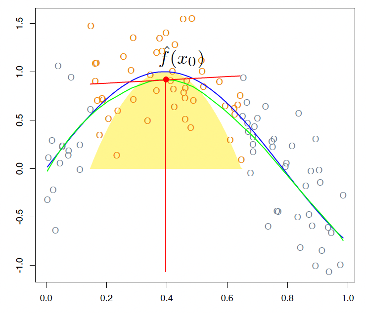

# Smoothing Techniques

```{r, include=FALSE}
opts_chunk$set(echo = TRUE, warning = FALSE)
opts_chunk$set(cache = FALSE)
opts_chunk$set(tidy.opts=list(width.cutoff=70),tidy=TRUE)
```

\newpage
\setstretch{1.05}

*Jie Jian*

Smoothing techniques are frequently used to reduce the variability of the observational data and enhance prediction accuracy, while still providing an adequate fit. In this workshop, we will introduce two popular smoothing methods, kernel smoothing and smoothing splines, from their formulations to the computations. Each method has a smoothing parameter that controls the amount of roughness. We will demonstrate how to choose the optimal tuning parameters from the perspective of variance-bias trade-off. Some examples of how to apply the two methods will be provided. Part of the codes and materials come from @hastie2009elements and @james2013introduction.

## Introduction

A fundamental problem in statistical learning is to use a data set $\{ (x_i,y_i) \}_{i=1}^n$ to learn a function $f(\cdot)$ such that $f(x_i)$ fit the data $y_i$ well, so we can use the estimated function $f$ on the new data $x$ to predict the future outcome $y$. In a statistical analysis, we have two sources of information, data and models. Data is "unbiased" but it contains noise, and models involve more constraints so contain less noise but introduce bias. In between the two extremes, we can use smoothing techniques to extract more information from the data and meanwhile control the variance.

#### Example: Boston house value

Housing values and other information about Boston suburbs. 

The variable *lstat* measures the percentage of individuals with lower socioeconomic status. The variable *medv* records median house values for 506 neighborhoods around Boston.

```{r}
library(MASS)
y = Boston$medv
x = Boston$lstat
y.lab = 'Median Property Value'
x.lab = 'Lower Status (%)'
plot(x, y, cex.lab = 1.1, col="darkgrey", xlab = x.lab, ylab = y.lab,
     main = "", bty = 'l')
```

```{r}
library(splines)
library(FNN)
xrange <- extendrange(x)
Xorder <- order(x)
xnew <- seq(min(xrange), max(xrange), length.out=500)

fit1 <- knn.reg(x, y=y, k=5)
fit2 <- lm(y ~ bs(x, degree= 3, df=4))
ypred2 <- predict(fit2,newdata=data.frame(x=xnew))

plot(x,y, 
     col="grey80", pch=19, cex=0.5,
     main = "Fits with different \"smoothness\"",
     xlab = x.lab, ylab = y.lab)
lines(x[Xorder], fit1$pred[Xorder], 
      col=adjustcolor("steelblue", 0.5),
      lwd=2)
lines(xnew, ypred2, col="darkgreen", lwd=2)

legend(max(xrange)-15, max(extendrange(y)),
       legend=c("5 nearest neighbours","B-spline df=4"),
       lty=c(1,1), lwd=2,
       col=c("steelblue", "darkgreen")
       )
```


## Kernel Smoothing Methods

A natural way to achieve smoothness is to utilize the local information of data to compute the fit, so that the the estimated model would not change too much over the data. In the kernel smoothing method, for any data point $x_i$, the value of the function at the point $f(x_0)$ is estimated using the combination of nearby observations. The contribution of each observation $x_i$ is calculated using a weight function, defined as Kernel $K_\lambda(x_0,x_i)$, related to the distance between $x_0$ and $x_i$. The parameter $\lambda$ controls the width of the neighborhood.

### Local linear regression

Locally weighted regression solves a separate weighted least squares problem at each target point $x_0$: $$\min\limits_{\alpha(x_0),\beta(x_0)} \sum_{i=1}^N K_\lambda (x_0,x_i) [y_i - \alpha(x_0)-\beta(x_0)x_i]^2.$$

The estimated function at each target point $x_0$ is $\hat{f}(x_0)=\hat{\alpha} (x_0)+\hat{\beta}(x_0) x_i$. We can only use it to fit at a single point. The smoothing parameter $\lambda$ in the kernel function, which determines the width of the local neighborhood, has to be determined. Large $\lambda$ implies lower variance (averages over more observations) but higher bias (we essentially assume the true function is constant within the window).
<center>

</center>
<center>

</center>

#### Computation

For each target point $x_0$,
$$\begin{bmatrix} \hat{\alpha} [x_0]  \\ \hat{\beta} [x_0] \end{bmatrix}=\arg\min\limits_{\alpha,\beta}  \sum_{i=1}^N K_\lambda (x_0,x_i)\cdot (y_i-\alpha-(x_i-x_0) \beta)^2,$$
if we define an $n-$by$-n$ weighting matrix $$W_h(x_0) = diag(K_\lambda(x_0,x_1),\cdots,K_\lambda(x_0,x_n)) ,$$
then we can rewrite this optimization as 
$$\begin{bmatrix} \hat{\alpha} [x_0]  \\ \hat{\beta} [x_0] \end{bmatrix}=\arg\min\limits_{\alpha,\beta} \| W_h(x_0) \cdot (Y- [\mathbf{1}_n\ \  X_0] \begin{bmatrix}\alpha  \\ \beta \end{bmatrix})^2\|^2_2,$$
which is a OLS optimization
$$\begin{bmatrix} \hat{\alpha}[x_0]  \\ \hat{\beta} [x_0]\end{bmatrix}=([\mathbf{1}_n\ \  X_0]' W_h(x_0) [\mathbf{1}_n\ \  X_0])^{-1}([\mathbf{1}_n\ \  X_0]'W_h(x_0) Y).$$

#### One-line implementation in R: loess

*loess* function in R fits a LOcally wEighted Sum of Squares estimate. 

- The local neighborhood determined by either 
  - span: the portion of points in the local neighborhood
  - enp.target: effective degrees of freedom
- The kernel is Tukey's tri-cube.
- Degree can be 0, 1, or 2. The default is a local quadratic.
- Up to 4 predictors.

```{r}
fit1=loess (y~x,span =.05)
fit2=loess (y~x,span =.3)

plot(x,y, 
     col="grey80", pch=19, cex=0.5,
     main = "loess with different spans",
     xlab = x.lab, ylab = y.lab)
lines(x[Xorder], predict(fit1,x[Xorder]), 
      col=adjustcolor("steelblue", 0.5),
      lwd=2)
lines(x[Xorder], predict(fit2,x[Xorder]), col="darkgreen", lwd=2)

legend(max(xrange)-15, max(extendrange(y)),
       legend=c("span=0.05","span=0.3"),
       lty=c(1,1), lwd=2,
       col=c("steelblue", "darkgreen")
       )
```


#### Bias and vairance

$\text{bias}(\hat{\alpha} [x_0])=O(h^2)$
and
$var (\hat{\alpha}[x_0])=O_p (\frac{1}{nh^d}),$
where $h$ is the bandwidth and $d$ is the dimensionality of $x$.

Theoretically, we can pick the bandwidth $h$ in some optimal sense such that $h=\arg\max\limits_{h} (c_1 h^4 + c_2 \frac{1}{nh^2})$. Therefore, the asymptotic rate for the bandwidth $h$ is $h=O(n^{-1/(d+4)})$.

[derivation skipped]

### Tuning Parameter (bandwidth) Selection

The tuning parameter $\lambda$ of the kernel $K_\lambda$ controls the width of the averaging window.
- if the window is narrow, $\hat{f}(x_0)$ is an average of a small number of $y_i$ close to $x_0$, and its variance will be relatively large while the bias will tend to be small.
- if the window is wide, the variance of $\hat{f}(x_0)$ will be small and the bias will be higher. 

Choosing the bandwidth is a bias-variance trade-off.

- Leave-one-out cross validation (LOOCV)

For each $i=1,\cdots,n$, compute the estimator $\hat{f}_\lambda^{(-i)} (x)$, where $\hat{f}_\lambda^{(-i)} (x)$ is comupted without using observation $i$. The estimated MSE is given by $$\hat{\text{MSE}}(\lambda)=\frac{1}{n} \sum_i (y_i-\hat{f}_\lambda^{(-i)} (x_i))^2.$$

[derivation needed]

### Extension and example: Local logistic regression

We can extend the local kernel smoothing method to 
$$\max \sum_{i=1}^N K_\lambda (x_0,x_i) l(y_i,x_i^T \beta(x_0)),$$
where $l(y_i,x_i^T \beta(x_0))$ is replaced by the specific log-likelihood. For example, in the local logistic regression where we consider logistic regression with a single quantitative input $X$.
The local log-odds at a target $x_0$ is 
$$\log \frac{\mathbb{P}(Y=1|X=x_0)}{\mathbb{P}(Y=0|X=x_0)}=\alpha(x_0)+\beta(x_0)x_i.$$
The objective function that we need to maximize is adjusted as 
$$\max \sum_{i=1}^N K_\lambda (x_0,x_i) [y_i \log p(x_i) + (1-y_i) \log (1-p(x_i))].$$

## Smoothing Spline

When fitting a function $f(\cdot)$ to a set of data, the first thing that we want is to find some function that fits the observed data well: that is, we want the residual sum of squares which measures the goodness of fit, $RSS=\sum_{i=1}^{n} (y_i - f(x_i))^2$, to be small. If this is our only repuirement, then we can even make RSS to zero by simply interpolating all observational data (a non-linear function that passes through exactly every data point). Such flexible function would overfit the data and lead to a large variance. Therefore, we not only require the RSS to be small, but also the function to be smooth. To achieve the smoothness of the estimated function, some penalty can be added to control the variability in $f(x)$.

Considering the two requirements, we are seeking a function $f(x)$ that minimizes $$\underbrace{\sum_{i=1}^{n} (y_i-f(x_i))^2}_\text{Model fit} + \lambda \underbrace{\int f''(x)^2 dx}_\text{Penalty term}$$
where $\lambda$ is a nonnegative tuning parameter. The function $f(x)$ is known as a *smoothing spline*.

- Model fit: different from the general linear regression problem where the function $f(x)$ is linear and we only need to estimate the coefficients of the predictors, here we minimize the objective function with respect to $f(x)$.
- Penalty term: the second term penalizes curvature in the function.
- Tuning parameter: 
  - when $\lambda =0$ we get a wiggly non-linear function, which has a high variance and low bias; 
  - As $\lambda$ increases the estimated function will be smoother; 
  - When $\lambda \rightarrow \infty$, $f''$ will be zero everywhere which leads to a linear model $f(x)=\beta_0+\beta_1 x$, which has a low variance but high bias.

### Computation

From the perspective of functional space @gu2013smoothing, the smoothing spline is the function $f_\lambda$ that minimizes the spline functional $$E[f]=\sum_{i=1}^{n} (y_i-f(x_i))^2 + \lambda \int f''(x)^2 dx$$ in the Sobolev space $W_2 (\mathbb{R})$ of functions with square integrable second derivative: $$f_\lambda = \arg \min_{f\in W_2 (\mathbb{R})} E[f].$$ 

Sobolev space is an infinite-dimensional function space, where the second term is defined. It can be shown that the solution to $\min E[f]$ is an explicit, finite-dimensional, unique minimizer which is a natural cubic spline with knots at the unique values of the predictor values $x_i$. Since the solution is a natural spline, we can write it as $f(x)=\sum_{i=1}^n N_j (x) \theta_j$, where the $N_j (x)$ are an N-dimensional set of basis functions for representing the family of natural splines. The criterion reduces to $$RSS(\theta,\lambda)=(y-N\theta)^\top (y-N\theta) + \lambda \theta^\top \Omega_N \theta,$$
where $\{ N \}_{ij}=N_j (x_i)$ and $\{ \Omega_N \}_{jk}=\int N''_j (t) N''_k (t) dt$. The solution is easily seen to be $$\hat{\theta} = (N^\top N + \lambda \Omega_N)^{-1} N^T y.$$
The fitted smoothing spline is given by $$\hat{f} (x) = \sum_{j=1}^N N_j (x) \hat{\theta}_j.$$

Although natural splines provide a basis for smoothing splines, it is computationally more convenient to operate in the larger space of unconstrained B-splines. We write $f(x)=\sum_{i=1}^{N+4}B_i(x)\theta_i$ (just to replace the basis functions from natural cubic splines to B-splines).

### Tuning Parameter Selection

The tuning parameter controls the tradeoff between smoothness of the estimate and fidelity to the data. In statistical terms, it controls the tradeoff between bias and variance. The optimal value of $\lambda$ has to be estimated from the data, usually by cross-validation or generalized cross-validation. 

- Cross validation
- Generalized cross-validation
  
  Usually degrees of freedom refer to the number of free parameters, such as the number of coefficients fit in a polynomial or cubic spline. Although a smoothing spline has $n$ parameters and hence $n$ nominal degrees of freedom, these $n$ parameters are heavily constrained or shrunk down. We use the effective degrees of freedom as a measure of the flexibility of the smoothing spline. We can write $$\hat{f}_\lambda = S_\lambda y,$$ where $\hat{f}$ is the solution for a given $\lambda$ and $S_\lambda$ is an $n-$by$-n$ matrix. The effective degrees of freedom is defined as the sum of the diagonal elements of the matrix $S_\lambda$: $$df_\lambda = \sum_{i=1}^n \{S_\lambda \}_{ii}.$$
The generalized cross validation (GCV) for such linear smoother is $$GCV(\hat{f})=\frac{1}{n} \sum_{i=1}^n (\frac{y_i - \hat{f}(x_i)}{1-tr (S)/n})^2.$$

[derivation needed]

```{r}
library(splines)

smooth1 = smooth.spline(x, y, df = 3)
smooth2 = smooth.spline(x, y, cv = TRUE)

par(mfrow = c(1,2))
plot(x, y, cex.lab = 1.1, col="darkgrey", xlab = x.lab, ylab = y.lab, 
     main = "Smoothing Spline (3 df)", bty = 'l')
lines(smooth1, lwd = 2, col = "brown")

plot(x, y, cex.lab = 1.1, col="darkgrey", xlab = x.lab, ylab = y.lab, 
     main = "Smoothing Spline (CV)", bty = 'l')
lines(smooth2, lwd = 2, col = "darkorange")
```

### Extension and example: Nonparametric logistic regression

The smoothing spline problem we talked above is posed in a regression setting, as the model fit part is $\sum_{i=1}^{n} (y_i-f(x_i))^2$. The technique can be extended to other problems, as long as we adjust the model fit term in the objective function to some likelihood-based formula. Here, we consider logistic regression with a single quantitative input $X$.
$$\log \frac{\mathbb{P}(Y=1|X=x)}{\mathbb{P}(Y=0|X=x)}=f(x).$$
 Our target is to fit a smooth function $f(x)$ to the logit, so that the conditional probability $\mathbb{P}(Y=1|x)=\frac{e^{f(x)}}{1+e^{f(x)}}$ is also smooth, which can be used for classification or risk measurement. In order to incorporate the smoothness penalty, the penalized log-likelihood criterion is 
 $$l(f;\lambda)=\sum_{i=1}^{N} [y_i \log p(x_i) + (1-y_i) \log (1-p(x_i))]-\frac{1}{2} \lambda \int \{f''(t) \}^2 dt.$$

It also can be shown that the solution to the optimization problem is the natural spline, so we can also express the function as $f(x)=\sum_{i=1}^N N_j (x) \theta_j$ where $N$ is the matrix of natural spline, or further it can be replaced by the B-spline for the same reason we have in the regression setting (approximation).


### Take-home note

- Smoothing techniques can incorporate with a variety of statistical methods. We introduced two methods:
  - Local linear regression: fit locally using some kernel function to measure the weight of each data point.
  $$\max \sum_{i=1}^N K_\lambda (x_0,x_i) l(y_i,x_i^T \beta(x_0))$$
  - Smoothing spline: add a penalty term in the objective function to prevent the function that needs to be estimated from not being smooth.
  $$\max \sum_{i=1}^N l(x_i,y_i) -\lambda P(f)$$

