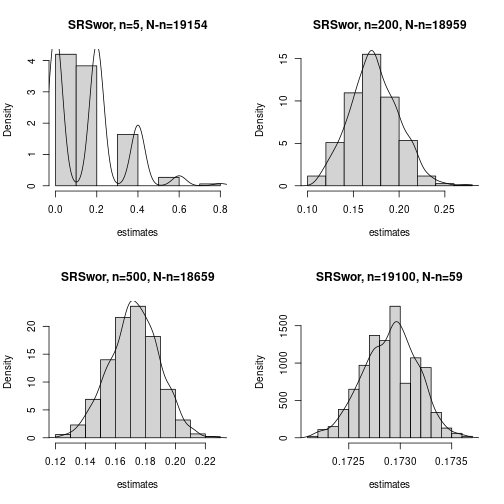
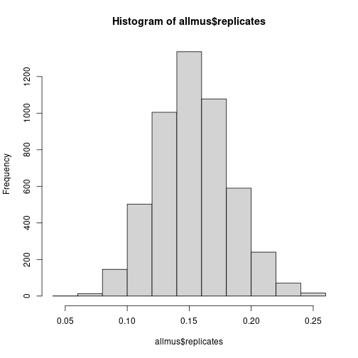

# Analyzing Surveys with R


\newpage
\setstretch{1.05}

*Gradon Nicholls*

## Acknowlegdements

Much of this workshop was informed by the book "Practical tools for designing and weighting survey samples" [@valliant2013practical], which is the survey practitioner's bible.

The standard reference on calibration: [@deville1993generalized]

I've also made use of course notes from STAT 332 offered by UWaterloo.

There is also [this webpage](https://r-survey.r-forge.r-project.org/survey/example-design.html) on specifying survey designs in R.

## Introduction to Thinking About Surveys

### Total Survey Error (TSE)

![The Total Survey Error (TSE) Framework [taken from @groves2010total]](figure/TSEframework.png)

TSE is divided into two parts:

- Errors of *Measurement*: Does the question wording capture the underlying concept?
Does the question wording affect how it is answered? Are there psychological processes
that cause respondents to give biased answers?
- Errors of *Representation*: Do our survey respondents "look like" the population we are interested in?

For this, we focus on errors of representation, which involve the following groups:

- *Target Population*: The population which we would like to infer something about.
- *Sampling Frame*: A list of addresses/phone numbers/etc. from which we will draw our sample.
- *Sample*: The subset of the sampling frame which we will attempt to recruit to our survey,
- *Respondents*: Those in the sample who agree to complete our survey.

TSE allows us to consider total error in our survey estimates as a sequential series
of errors. Much of survey research is devoted to zeroing on each type of error
to study its causes and potential solutions. The types of errors of representation are:

- *Coverage Error*: Does our frame cover the entire target population? 
- *Sampling Error*: Error caused by how we draw the sample. In a probability survey, this is generally the only portion we have full control over.
- *Nonresponse Error*: Do those who agree to our survey differ from tose who don't respond?

### Probability vs. Non-Probability Surveys

A *probability survey* is one where everyone in the sampling frame has a known
and non-zero probability of being included in the sample. For example,
we have a list of all addresses in Canada, and we take a random sample of addresses
for our study.

A *non-probability survey* is one where such an inclusion probability is not known.
For example, we take out ads on websites recruiting participants to join our
*opt-in panel*. In this case we have no way of knowing how likely it is that each
member of the target population makes it into our panel.

### Design-based vs. Model-based Inference

- *Design-based*: rely fully on the sampling design
- *Model-assisted*: sampling design is the basis (e.g. probability survey with model for non-response)
- *Model-based*: rely fully on a model (e.g. calibration weights in a non-probability survey)

## Probability Survey without Non-response (design-based)

### Some notation

- $i$: a member of the population
- $U$: the set of all members of the population
- $S$: our randomly drawn sample
- $I_i = I(i \in S)$: inclusion indicator
- $\pi_i = \Pr(i \in S)$: inclusion probability
- $\pi_{ij} = \Pr(i,j \in S)$: joint inclusion probability
- $n$: sample size
- $N$: population size

### Horvitz-Thompson Estimator

Let's say we are interested in estimating $\mu_U$, the population total. I.e.
$\mu_U = \sum\limits_{i \in U} y_i$. Taking a census would be too expensive,
so instead we want to use a weighted average from our sample data:
$\hat \mu = (1/N)\sum\limits_{i \in S} w_i y_i$. *Question:* **how do we select $w_i$
such that our estimate is unbiased?**

$$
\begin{aligned}
&\text{we desire that }E[\hat \mu] = \mu_U \\
\implies& E\left[\frac{1}{N}\sum_{i \in S} w_i y_i\right] = \mu_U \\
\implies& E\left[\frac{1}{N}\sum_{i \in U} I_i w_i y_i\right] = \mu_U \\
\implies& \frac{1}{N}\sum_{i \in U} E[I_i] w_i y_i = \mu_U \\
\implies& \frac{1}{N}\sum_{i \in U} \pi_i w_i y_i = \mu_U \\
\implies& \frac{1}{N}\sum_{i \in U} \pi_i w_i y_i = \frac{1}{N}\sum_{i \in U} y_i \\
\implies& \text{we should set } w_i = 1/\pi_i
\end{aligned}
$$

By setting $w_i = 1/\pi_i$, we have derived the *Horvitz-Thompson estimator*.
In words, HT tells us to weight each sample observation by the inverse of their
inclusion probability.

To get the HT estimator of the mean, we simply divide by $N$. I.e. 
$\hat \mu = \frac{1}{N}\sum_{i \in S} (1/\pi_i) y_i$.

### Variance Estimation

Most generally, the variance of the HT estimator for the total is,

$$
\text{Var}(\hat t) = \sum_{i \in U} \pi_i(1-\pi_i) \left(\frac{y_i}{\pi_i}\right)^2 + \sum_{i,j \in U; i \neq j} (\pi_{ij} - \pi_i\pi_j)\frac{y_i}{\pi_i}\frac{y_j}{\pi_j}
$$

which we can in principle estimate using our sample data. Notice that it relies on
joint inclusion probailities $\pi_{ij}$!

### Simple Random Sampling Without Replacement (SRSwor)

We select $n$ individuals from a population of $N$ completely at random. 
That is, $\pi_i = \frac{n}{N}$ and $\pi_{ij} = \frac{n}{N}\frac{n-1}{N-1}$.

We have that $\hat \mu = (1/N)\sum_{i \in S} \frac{N}{n} y_i = (1/n) \sum_{i \in S} y_i$ and
$\text{Var}(\hat \mu) = (1 - \frac{n}{N})\frac{\sigma^2}{n}$.
We call $f = \frac{n}{N}$ the sampling fraction and $1-f$ the finite
population correction factor (fpc).

When $n \to \infty$ and $N-n \to \infty$, we have that $\hat \mu$ is approximately normally distributed.

Let's implement this in R using our own formulas:


```r
# package associated with Valliant, Devant & Kreuter, includes data
pacman::p_load("PracTools")

# bring data into our environment
data(nhis.large)
nhis.large.clean = nhis.large %>%
  filter(!is.na(educ)) %>%
  mutate(hasdegree = as.numeric(educ>2))
N = nrow(nhis.large.clean)

# draw a SRSwor of size n=300
set.seed(310732)
n=300; f = n/N
S = sample(N,size=n,replace=FALSE)
nhis.sample = nhis.large.clean[S,]

# population mean
mu_U = mean(nhis.large.clean$hasdegree)

# 95% CI for the mean using survey methods
mu_hat = mean(nhis.sample$hasdegree)
SE_mu = sqrt(1 - f)*sd(nhis.sample$hasdegree)/sqrt(n)
c(mu_hat - 1.96*SE_mu, mu_hat + 1.96*SE_mu)
```

```
## [1] 0.1703366 0.2629967
```

```r
# 95% CI using 231 methods
mu_hat = mean(nhis.sample$hasdegree)
SE_mu = sd(nhis.sample$hasdegree)/sqrt(n)
c(mu_hat - 1.96*SE_mu, mu_hat + 1.96*SE_mu) # pretty much identical! --> why?
```

```
## [1] 0.1699696 0.2633638
```

For more complicated designs, it will be useful to learn how to use the survey package in R:


```r
# survey package
pacman::p_load("survey")

# append sampling probabilities to the data
nhis.sample = nhis.sample %>%
  mutate(pr_incl = n/N)

# append population size to the data
nhis.sample = nhis.sample %>%
  mutate(N = N)

# specify the survey design
SRSdesign = survey::svydesign(
  ids=~1, # simple one-stage design
  strata=NULL, # no strata
  probs=~pr_incl, # prob = n/N
  data=nhis.sample, # sample data
  fpc=~N) # population size

# estimate the mean, 95% confidence interval
muhat = svymean(~hasdegree,design=SRSdesign)
confint(muhat)
```

```
##               2.5 %    97.5 %
## hasdegree 0.1703375 0.2629959
```

```r
# you could use a t distn if you want to, but it has no theoretical backing!
confint(muhat,df=199)
```

```
##              2.5 %    97.5 %
## hasdegree 0.170054 0.2632793
```

Let's visualise the distribution of our estimator for different choices of $n$.


```r
# set seed
set.seed(310732)

# generate plots in 2 by 2 array
par(mfrow=c(2,2))

# n = 5
n = 5
estimates = rep(NA,1000)
for (i in 1:1000) {
  S = sample(N,size=n,replace=FALSE)
  estimates[i] = mean(nhis.large.clean[S,]$hasdegree)
}
hist(estimates,freq=FALSE,main="SRSwor, n=5, N-n=19154")
lines(density(estimates))

# n = 200
n = 200
estimates = rep(NA,1000)
for (i in 1:1000) {
  S = sample(N,size=n,replace=FALSE)
  estimates[i] = mean(nhis.large.clean[S,]$hasdegree)
}
hist(estimates,freq=FALSE,main="SRSwor, n=200, N-n=18959")
lines(density(estimates))

# n = 500
n = 500
estimates = rep(NA,1000)
for (i in 1:1000) {
  S = sample(N,size=n,replace=FALSE)
  estimates[i] = mean(nhis.large.clean[S,]$hasdegree)
}
hist(estimates,freq=FALSE,main="SRSwor, n=500, N-n=18659")
lines(density(estimates))

# n = 19000
n = 19000
estimates = rep(NA,1000)
for (i in 1:1000) {
  S = sample(N,size=n,replace=FALSE)
  estimates[i] = mean(nhis.large.clean[S,]$hasdegree)
}
hist(estimates,freq=FALSE,main="SRSwor, n=19100, N-n=59")
lines(density(estimates))
```




### Stratified Simple Random Sampling Without Replacement (SSRSwor)

Imagine we have $H$ strata (e.g. provinces) indexed by $h$. In each stratum,
there is a population $N_h$, such that $N = \sum_{h=1}^H N_h$. We conduct a
SRSwor of size $n_h$ in each stratum. 

Then, the inclusion probability for an individual in stratum $h$ is $\pi_i^h = \frac{n_h}{N_h}$.
The joint inclusion probability for two individuals in stratum $h$ is $\pi_{ij}^h = \frac{n_h}{N_h}\frac{n_h-1}{N_h-1}$. The joint inclusion probability for two individuals in *different* strata is $\pi_{ij}^{hh'} = \frac{n_h}{N_h} \frac{n_{h'}}{N_{h'}}$.

We have that $\hat \mu = \sum_{h=1}^H \frac{N_h}{N} \hat \mu_h$ where $\hat \mu_h$
is the SRSwor estimator within each stratum.

Furthermore, $\text{Var}(\hat \mu) = \sum\limits_{h=1}^H \left(\frac{N_h}{N}\right)^2 (1-f_h) \frac{\sigma^2_h}{n_h}$.

In R, let's simulate a stratified simple random sample:


```r
# we want to stratify by race
N_h = table(nhis.large.clean$race)

# want to obtain estimates by subgroup: oversample the smaller groups
n_h = c("1"=100,"2"=100,"3"=100)

# sampling fractions by stratum
f = n_h / N_h

# draw a SSRSwor
set.seed(87876)
S = survey::stratsample(
  strata = nhis.large.clean$race,
  counts = n_h)
nhis.sample = nhis.large.clean[S,]
```

Now we estimate:


```r
# append sampling probabilities to the data
nhis.sample = nhis.sample %>%
  mutate(pr_incl = f[race])

# append population size to the data
nhis.sample = nhis.sample %>%
  mutate(N = N_h[race])

# specify the survey design
SSRSdesign = survey::svydesign(
  ids=~1, # simple one-stage design
  strata=~race, # stratify by race
  probs=~pr_incl, # prob = n/N
  data=nhis.sample, # sample data
  fpc=~N) # population size

# estimate the mean, 95% confidence interval
muhat = svymean(~hasdegree,design=SSRSdesign); muhat
```

```
##              mean     SE
## hasdegree 0.14919 0.0293
```

```r
confint(muhat)
```

```
##                2.5 %    97.5 %
## hasdegree 0.09170761 0.2066743
```

```r
# mean by race
svyby(~hasdegree,by=~race,FUN=svymean,
      design=SSRSdesign)
```

```
##   race hasdegree         se
## 1    1      0.15 0.03577108
## 2    2      0.10 0.02961191
## 3    3      0.30 0.04321784
```

```r
# compare with unstratified design
svyby(~hasdegree,by=~race,FUN=svymean,
      design=SRSdesign)
```

```
##   race hasdegree         se
## 1    1 0.2280702 0.02761555
## 2    2 0.1071429 0.04107490
## 3    3 0.4375000 0.12325037
```


## Post-adjustment (model-assisted)

Let's say we've conducted our survey and have our estimate
$\hat \mu = (1/N) \sum_{i \in S} (1/\pi_i) y_i$. Now we ask,
*Can we use information we know about the population to "improve"
our estimate?*

In other words, we want to consider a "post-adjustment" to the inverse probability weights
so that $w_i = (1/\pi_i) \theta_i$. To do this we want to incorporate auxiliary
information $X_i$ that we know about each individual $i$, for which we also
have information about the population.

### Post-stratification

For example, consider the HT estimator for stratification:

$$
\hat \mu = \sum_{h=1}^H \frac{N_h}{N} \hat \mu_h
$$

Even if we did not stratify in our sampling design, it makes intuitive sense
to use this type of estimator after the fact. For example, perhaps we were not
able to stratify based on age group, but we asked individuals' age on the survey.
Using information from the census, we can thus "post"-stratify [@valliant1993poststratification] our sample based on age group.
Let's call this estimator $\hat \mu_{\text{PS}}$

$$
\hat \mu_{\text{PS}} = \sum_{h=1}^H \frac{N_h}{N} \hat \mu_{h,\text{PS}}
$$
where $\hat \mu_{h,\text{PS}} = \frac{1}{N_h} \sum\limits_{i \in S} I(i \in U_h)\dfrac{N_h}{\widetilde{n_h}} y_i$.

There is one key difference: in SSRSwor, the researcher chose the sample size $n_h$
within each stratum. Here, the researcher does NOT know the sample size until the sample
is taken. In other words, $\widetilde{n_h}$ is a *random variable*!

Thus, $\hat \mu_{h,\text{PS}}$ is not the nice linear estimator we had before.
We no longer have a simple closed formula for the variance of the estimator.
Now we must take a different strategy:

* taylor approximation: equivalent to using the variance formula for an SSRSwor.
This would tend to slightly underestimate the variance, because we do not take into account variability from $\widetilde{n_h}$.
* resampling methods, e.g. bootstrap

Let's take our SRS sample and post-stratify it based on race:


```r
# collect population counts in format needed for postStratify
popcounts = data.frame(race=c(1,2,3), 
                       Freq=as.numeric(table(nhis.large.clean$race)))
PSdesign = survey::postStratify(
  design=SRSdesign, # the initial design
  strata=~race,     # the variable we post-stratify on
  population=popcounts)   # population counts
```

Compare SRS with post-stratified SRS: 
We see a small adjustment in the overall estimate and standard error:


```r
# estimate of overall mean
muhat = svymean(~hasdegree,design=SRSdesign); muhat
```

```
##              mean     SE
## hasdegree 0.21667 0.0236
```

```r
confint(muhat)
```

```
##               2.5 %    97.5 %
## hasdegree 0.1703375 0.2629959
```

```r
muhat = svymean(~hasdegree,design=PSdesign); muhat
```

```
##              mean     SE
## hasdegree 0.21941 0.0238
```

```r
confint(muhat)
```

```
##               2.5 %    97.5 %
## hasdegree 0.1728354 0.2659927
```

Compare SSRS with post-stratified SRS estimates by race: We see that
post-stratification is really only a tool to get "better" *overall* estimates.
Post-stratification still doesn't let us get better estimates within-stratum.


```r
# estimate by race
svyby(~hasdegree,by=~race,FUN=svymean,
      design=SSRSdesign)
```

```
##   race hasdegree         se
## 1    1      0.15 0.03577108
## 2    2      0.10 0.02961191
## 3    3      0.30 0.04321784
```

```r
svyby(~hasdegree,by=~race,FUN=svymean,
      design=PSdesign)
```

```
##   race hasdegree         se
## 1    1 0.2280702 0.02761555
## 2    2 0.1071429 0.04107490
## 3    3 0.4375000 0.12325037
```

### Calibration: Dealing with multiple auxilliary variables

Let's say we want to post-adjust our estimate on race, but also on gender and age group?
In order to use post-stratification, we need to know the entire 3-way table of population
counts. For example, we need to know how many white men aged 55+ there are in the population.

We can use other calibration techniques (which post-stratification can be considered
a general case of) like *raking* that rely only one *one-way* tabulations.


```r
# define population totals for each raking variable
pop.sex = data.frame(sex=c(1,2), 
                     Freq=as.numeric(table(nhis.large.clean$sex)))
pop.age.grp = data.frame(age.grp=c(1,2,3,4,5), 
                     Freq=as.numeric(table(nhis.large.clean$age.grp)))

rakedesign = survey::rake(
  design=SSRSdesign,
  sample.margins=list(~sex,~age.grp),
  population.margins=list(pop.sex,pop.age.grp)
  )

muhat = svymean(~hasdegree,design=SSRSdesign); muhat
```

```
##              mean     SE
## hasdegree 0.14919 0.0293
```

```r
confint(muhat)
```

```
##                2.5 %    97.5 %
## hasdegree 0.09170761 0.2066743
```

```r
muhat = svymean(~hasdegree,design=rakedesign); muhat
```

```
##              mean     SE
## hasdegree 0.15249 0.0298
```

```r
confint(muhat)
```

```
##                2.5 %    97.5 %
## hasdegree 0.09410781 0.2108778
```

### What makes a good calibration variable?

E.g. see [@lundy2022relative].

### Variance Estimation: Resampling

Let's see how the bootstrap version of post-stratification:


```r
# start with bootsrapped SRS
set.seed(1902)
bootstrapSRS = survey::as.svrepdesign(
  design=SRSdesign,
  type="bootstrap",
  replicates=5000)

# apply post-stratification to every replicate weight
bootstrapPS = survey::postStratify(
  design=bootstrapSRS, 
  strata=~race,     
  population=popcounts)   

muhat = svymean(~hasdegree,design=PSdesign); muhat
```

```
##              mean     SE
## hasdegree 0.21941 0.0238
```

```r
confint(muhat)
```

```
##               2.5 %    97.5 %
## hasdegree 0.1728354 0.2659927
```

```r
muhat = svymean(~hasdegree,design=bootstrapPS); muhat
```

```
##              mean     SE
## hasdegree 0.21941 0.0242
```

```r
confint(muhat)
```

```
##               2.5 %    97.5 %
## hasdegree 0.1719077 0.2669204
```

How about the raking estimate:


```r
# start with bootstrap replicated SSRS
set.seed(76573)
bootstrapSSRS = survey::as.svrepdesign(
  design=SSRSdesign,
  type="bootstrap",
  replicates=5000)

# rake each bootstrap replicate
bootrakedesign = survey::rake(
  design=bootstrapSSRS,
  sample.margins=list(~sex,~age.grp),
  population.margins=list(pop.sex,pop.age.grp)
  )

muhat = svymean(~hasdegree,design=SSRSdesign); muhat
```

```
##              mean     SE
## hasdegree 0.14919 0.0293
```

```r
confint(muhat)
```

```
##                2.5 %    97.5 %
## hasdegree 0.09170761 0.2066743
```

```r
muhat = svymean(~hasdegree,design=rakedesign); muhat
```

```
##              mean     SE
## hasdegree 0.15249 0.0298
```

```r
confint(muhat)
```

```
##                2.5 %    97.5 %
## hasdegree 0.09410781 0.2108778
```

```r
muhat = svymean(~hasdegree,design=bootrakedesign); muhat
```

```
##              mean     SE
## hasdegree 0.15249 0.0299
```

```r
confint(muhat)
```

```
##                2.5 %    97.5 %
## hasdegree 0.09383431 0.2111513
```

We can ask the svy commands to produce all replicates of the estimate.
Doing this we can get confidence intervals based on the actual distribution
of the estimates.


```r
allmus = svymean(~hasdegree,design=bootrakedesign,return.replicates=TRUE)
hist(allmus$replicates)
```



```r
quantile(allmus$replicates,probs=c(0.025,0.975))
```

```
##       2.5%      97.5% 
## 0.09744063 0.21383397
```


## Non-probability Surveys (model-based)

Previously we started with a survey design (design-based approach),
and then possibly made adjustments to the design weights in order
to "improve" our estimates. In a non-probability survey context
(or probability survey with non-response), we no longer have a proper design.
That is, we no longer have full information about the inclusion probabilities
$\pi_i$. 

A review of inference in non-probability samples can be found in [@elliott2017inference]. To summarise, we can take the same thought process
as before. Namely, we have our mean estimate $\hat \mu = \sum_{i \in S} \frac{1}{\gamma_i}y_i$ where $\gamma_i$ is our "pseudo-inclusion probability".

That is, we think of it as $\gamma_i = \Pr(i \text{ joins our survey})$.
However, we no longer have any degree of control over this.
For instance, $i$ joining our survey could include the following steps:

* $i$ has access to the internet
* $i$ volunteers for our opt-in survey panel conditional on having access to the internet
* $i$ is sampled from the panel given they belong to the panel
* $i$ responds to our survey given we sampled them from the panel

We must assume that each step has some *non-zero* probability of occurring.
Furthermore, we must assume that these probabilities rely only on some variables
$X$ which we *observe in both the sample and the population.*

That is we estimate using $\hat \mu (X) = \sum_{i \in S} w_i(x_i; \beta) y_i$
where $w_i(x_i; \beta)$ is our "psuedo-weight" which can be computed using
calibration methods discussed above.

This has direct parallels with causal analysis: if we don't have a properly
randomized experiment, then we attempt to make the treatment and control
groups as "similar" as possible (using inverse probabliity weighting, propensity scores,
matching, etc.) such that any difference that remains must
be due to the treatment. However, this relies on the assumption that
we have selection only on the observables $X$!
