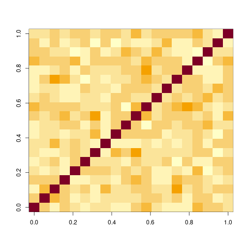
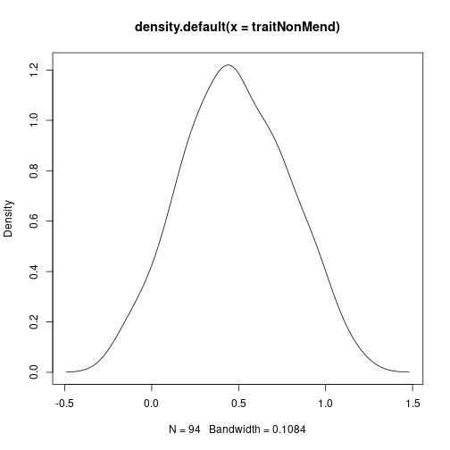
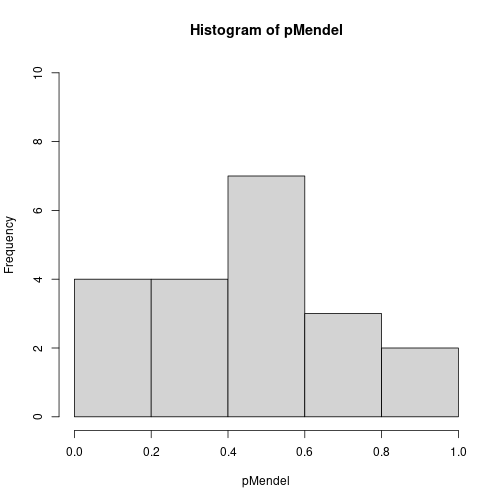
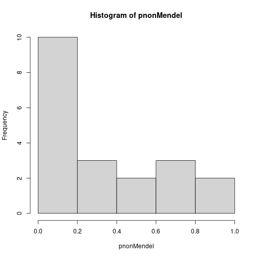
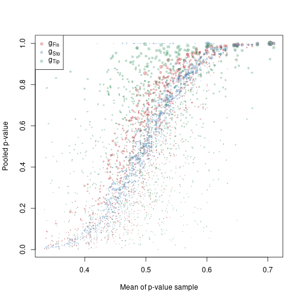
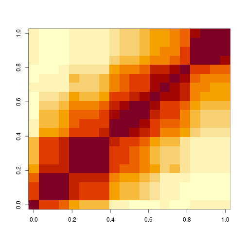
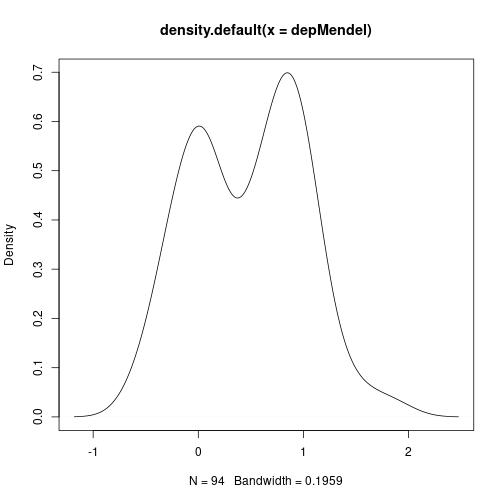
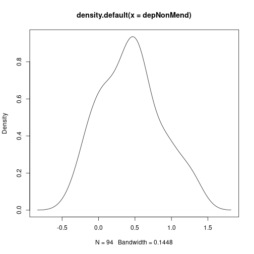

# Pooled p-values


\newpage
\setstretch{1.05}

*Chris Salahub*

When presented with a large number of $p$-values from a large number of tests, we occasionally want to be lazy. Rather than fitting a big model or working very hard to try and make sense of each value individually in context, we'd like to have a quick means of telling whether the $p$-values are worth looking at more closely.

## A motivating example

Let's say, for example, we've collected a bunch of genetic data and would like to identify which genes are related to a physical trait. We'll start by defining some terms to make description easier.

- **DNA**: genetic information that is passed between generations and is stored in several big molecules made up of many small molecules called nucleotides
- **genome**: all the DNA of an organism
- **gene**: a segment of DNA that gives the blueprint for a particular protein
- **chromosomes**: one of the several big molecules making up the genome
- **marker**: a segment of DNA measured at a known position
- **sex**: the creation of an organism in a new generation by recombining DNA from two organisms in the previous generation
- **recombination**: when DNA is changed slightly between generations by segments of DNA literally crossing each other and switching or chromosomes being inherited independently, pictorially: {width=100%}
- **centiMorgans**: an additive measure of distance on DNA, for two markers which have probability $q$ of being separated during sex the distance in centiMorgans is $d = 50 \ln \frac{1}{1 - 2q}$

So, when we talk about genetic data, we mean **markers** at known positions on **chromosomes** which ideally span the whole **genome** of a sample of organisms. We pair this data with a physical measurement - in humans examples include height, eye colour, hair colour, or the presence of a disease - to determine how much physical variation can be explained by genetic variation.

Physical traits that are linked to genetics are either Mendelian or non-Mendelian (you can guess which came first). Mendelian traits have variation explained by one (or very few) gene(s), take eye colour in humans which is mostly down to the gene *OCA2*. Non-Mendelian traits, like height, have variation which cannot be attributed to one (or a handful of) genetic region(s) alone.

To identify which measured markers are related to a physical trait, a host of significance tests are typically computed to assay the impact of each. While this is not the best way to do this, a linear model would do much better, it is frequently the only option for genetic studies which collect hundred of thousands of markers for only a few dozen individuals. Difficulty fitting a model practically means we must filter these markers first.

Before even pointing our finger at a subset of genes, however, we might want to save time by asking whether there is anything interesting happening *at all* in this collection of tests. That is where pooled $p$-values come in.

### Some "real" data

Our ideal data set would involve humans. Genomics mostly strives to better understand the genetic sources of human diseases and traits to help create better medicine and understand ourselves more fully. Unfortunately, human data is pretty hard to come by ethically, and mice data is a lot easier to find. The code below pulls some that is freely available from [Mouse Genome Informatics](https://www.informatics.jax.org/).


```r
## this script downloads mouse genomic data from the mouse genome 
## database (MGD), an online repository of data on mouse genetics
## all the data is stored in text files at
mgiUrl <- "https://www.informatics.jax.org/downloads/reports/"
## we'll be looking at data from
mgiPName <- "MGI_JAX_BSB_Panel.rpt"
## and for reference we'll also need the marker lists in    
mgiMNames <- c("MRK_List1.rpt", "MRK_List2.rpt")

## this function reads in MGI text files, which are basically organized
## as a tab-separated table with extra information
readMGIrpt <- function(file) {
    raw <- scan(file, what = character(), sep = "\n") # most basic R input
    leg <- which(raw == "Legend:") # identify the legend rows
    lenHead <- leg + 4 # the +4 is from inspection of the legends
    if (length(leg) == 0) { # separate legend
        leg <- which(grepl("^CHR", raw))[1]
        lenHead <- leg
    }
    desc <- paste(raw[1:lenHead], collapse = "\n") # data description
    dat <- raw[(lenHead+1):length(raw)] # actual data
    ## each row in the data is associated with a reference, the study
    ## or paper that characterized or collected the corresponding
    ## observation, we want to separate these
    refPos <- regexec("\\tJ\\:[0-9]+(?:, J\\:[0-9]+){0,4}", dat)
    refs <- sapply(regmatches(dat, refPos), # extract references
                   function(el) {
                       if (length(el) == 0) {
                           ""
                       } else gsub("\\t", "", el)})
    data <- unlist(regmatches(dat, refPos, invert = TRUE)) # remove refs
    mat <- do.call(rbind, strsplit(data[data != ""], "\\t")) # regularize
    rwnms <- mat[1, -(1:3)] # animal numbers/ids
    colnms <- mat[-1, 3] # symbol field
    colDesc <- mat[-1, 1:3] # symbol details
    colnames(colDesc) <- c("chr", "mgiid", "symbol") # informative names
    data <- t(mat[-1,-(1:3)]) # observed values
    rownames(data) <- rwnms # final data formatting
    colnames(data) <- colnms
    list(summary = desc, # return everything in a big list
         markers = data.frame(colDesc, ref = refs[-1]),
         data = as.data.frame(data))
}

## this function looks at the marker reference data and processes it into
## a form easier for future analysis
readMGIlists <- function(fileList = paste0(mgiUrl, mgiMNames)) {
    lists <- lapply(fileList, scan, # similar input to above
                    what = character(), sep = "\n")
    lists <- lapply(lists, gsub,  # replace end of line tabs with periods
                    pattern = "\t$", replacement= "\t.")
    splits <- lapply(lists, strsplit, split = "\t") # split by tabs
    colnms <- splits[[1]][[1]] # column names
    data <- do.call(rbind, # covert into one big matrix
                    lapply(splits, 
                           function(splt) do.call(rbind, splt[-1])))
    colnames(data) <- colnms
    as.data.frame(data)
}

## using indices and a reference table, process centiMorgan positions
processcMs <- function(inds, tab) {
    sel <- tab[inds] # take indices from table
    sel[grepl("syntenic", sel)] <- "Inf"
    suppressWarnings(as.numeric(sel)) # warnings by design
}

## this function goes through a processed panel from the above functions
## and drops the measurements that are NA or Inf
filterPanelBycM <- function(panel, locs) {
    locOrd <- order(locs) # order position
    toKeep <- is.finite(locs[locOrd]) # drop NAs and Infs
    outMrk <- data.frame(panel$markers[locOrd[toKeep],],
                         cMs = locs[locOrd[toKeep]])
    outMrk <- outMrk[order(outMrk$chr),] # order chromosome
    list(summary = panel$summary,
         markers = outMrk, data = panel$data[, outMrk$symbol])
}

## pull the marker reference
mgiMarkers <- readMGIlists() # descriptions of all markers

## pull the panel
mgiPanel <- readMGIrpt(paste0(mgiUrl, mgiPName))

## match the marker names back to the marker reference
mgiPanel.mrkr <- match(names(mgiPanel$data),
                        mgiMarkers$`Marker Symbol`)
## get cM positions
mgiPanel.cMs <- processcMs(mgiPanel.mrkr, 
                           tab = mgiMarkers$`cM Position`)
## Infs indicate markers localized to a chromosome but without a
## known cM position, while NAs indicate markers missing from the
## reference file or marked as unknown there

## filter the panels by markers with known positions
mgiFiltered <- filterPanelBycM(mgiPanel, mgiPanel.cMs)
## and convert the data to numeric values
mgiFiltered$data <- as.data.frame(lapply(mgiFiltered$data,
                           function(mrkr) as.numeric(mrkr== "b")))

## remove intermediate data
rm(list = c("mgiMarkers", "mgiPanel.cMs", "mgiPanel.mrkr",
            "mgiPanel"))

summary(mgiFiltered)
```

```
##         Length Class      Mode     
## summary    1   -none-     character
## markers    5   data.frame list     
## data    1598   data.frame list
```

```r
dim(mgiFiltered$data)
```

```
## [1]   94 1598
```

In the end, after reading and cleaning the data, we have 94 mice each measured at 1598 marker locations. We are still in the unfortunate position of lacking physical measurements for any of the 94 mice on this panel, but we won't let that stop our workshop! To mimic Mendelian traits, we can pick a marker and generate a trait based solely on its value, while mimicking non-Mendelian traits requires the selection of numerous locations which may not contribute equally.

For now, let's keep this as simple as possible by ensuring independence and equal contributions of each marker. Chromosomes assort independently, so if we take one marker from each chromosome we should have independent markers.


```r
## match in this context will give the index of the first marker on
## each chromosome
mgiIndep <- mgiFiltered$data[, match(c(1:19, "X"), mgiFiltered$markers$chr)]
## inspect dependence structure
image(cor(mgiIndep))
```



To simulate a Mendelian trait, we'll simply add noise to the first marker. For non-Mendelian inheritance, let's take the average of all markers and add noise.


```r
set.seed(2314)
traitMendel <- mgiIndep[, 1] + rnorm(94, sd = 0.3)
plot(density(traitMendel))  # what mendelian traits look like

traitNonMend <- apply(mgiIndep[, 1:20], 1, mean) + rnorm(94, sd = 0.3)
plot(density(traitNonMend))  # what non-mendelian traits look like
```



Finally, we can compute $p$-values for each marker and the traits based on the correlation between them.


```r
## based on the mendelian trait
(pMendel <- apply(mgiIndep, 2, function(col) cor.test(traitMendel, col,
    method = "kendall")$p.value))
```

```
##     D1Mit475     D2Mit312      D3Mit60     D4Mit149     D5Mit331      D6Mit86      D7Mit21       Fcer2a     D9Mit186    D10Mit166      D11Mit1 
## 1.534175e-16 6.824098e-01 5.068242e-01 6.829543e-01 8.917066e-01 2.992248e-01 5.961899e-01 3.932094e-01 7.507340e-01 4.141103e-01 4.231891e-02 
##     D12Mit37    D13Mit158    D14Mit179     D15Mit12     D16Mit32        Tfb1m     D18Mit66     D19Mit32      DXMit26 
## 2.401990e-01 5.082020e-01 2.662022e-01 4.665408e-01 1.844711e-01 1.360688e-01 4.732496e-01 5.909141e-01 9.307018e-01
```

```r
## based on the non-mendelian trait
(pnonMendel <- apply(mgiIndep, 2, function(col) cor.test(traitNonMend,
    col, method = "kendall")$p.value))
```

```
##   D1Mit475   D2Mit312    D3Mit60   D4Mit149   D5Mit331    D6Mit86    D7Mit21     Fcer2a   D9Mit186  D10Mit166    D11Mit1   D12Mit37  D13Mit158 
## 0.89472070 0.09253545 0.13757128 0.22621058 0.07549440 0.56469712 0.65008451 0.04082007 0.12843907 0.11980696 0.03455362 0.25570435 0.28700806 
##  D14Mit179   D15Mit12   D16Mit32      Tfb1m   D18Mit66   D19Mit32    DXMit26 
## 0.73358350 0.77494661 0.51304455 0.11368337 0.14611911 0.15727257 0.82347631
```


```r
## some null cases
pNull <- replicate(1000, apply(mgiIndep, 2, function(col) {
    cor.test(runif(94), col, method = "kendall")$p.value
}))
head(t(pNull))
```

```
##        D1Mit475  D2Mit312    D3Mit60   D4Mit149  D5Mit331   D6Mit86   D7Mit21    Fcer2a    D9Mit186  D10Mit166   D11Mit1   D12Mit37  D13Mit158
## [1,] 0.91268889 0.9155166 0.44057344 0.57053011 0.7109228 0.7104213 0.9361935 0.6625519 0.903676933 0.09295126 0.9066941 0.61167595 0.90315172
## [2,] 0.69695226 0.4131551 0.33937625 0.54010605 0.2629633 0.8975040 0.3197514 0.8584467 0.939708593 0.60228265 0.9487503 0.65482901 0.47939849
## [3,] 0.99698325 0.5393703 0.04396815 0.07304071 0.6663768 0.4531596 0.7632931 0.3486067 0.933692719 0.74391544 0.3237270 0.68797867 0.98786455
## [4,] 0.79418075 0.3208888 0.33167468 0.67741095 0.6829543 0.4486095 0.4572592 0.1803964 0.008114586 0.21910493 0.5991995 0.03022549 0.91520882
## [5,] 0.05429148 0.5494324 0.03791381 0.71092280 0.5351154 0.2401990 0.6175043 0.2260813 0.034191029 0.83974007 0.8117261 0.68797867 0.05928764
## [6,] 0.47954305 0.1478201 0.83885530 0.77379283 0.8737982 0.6658075 0.9119715 0.5666431 0.710922799 0.98758873 0.1047974 0.92754962 0.78425210
##       D14Mit179  D15Mit12  D16Mit32     Tfb1m   D18Mit66  D19Mit32    DXMit26
## [1,] 0.09763453 0.9847927 0.4206221 0.6318542 0.75279081 0.6391459 0.67471523
## [2,] 0.02827514 0.7984038 0.9126889 0.9272855 0.56151556 0.3087532 0.07250225
## [3,] 0.73358350 0.7516931 0.6097514 0.7667740 0.64067853 0.3386443 0.43382873
## [4,] 0.02882409 0.7749466 0.5939547 0.7264643 0.56151556 0.9240737 0.12757793
## [5,] 0.17099493 0.8878311 0.1373020 0.9636049 0.91237224 0.6391459 0.55277353
## [6,] 0.44041744 0.8398827 0.8768064 0.6050557 0.04977771 0.4480823 0.62573218
```

## Pooling $p$-values

Whether inheritance is Mendelian, non-Mendelian, or something else, our selection of markers tested against a trait gives a collection of $M=20$ $p$-values from 20 hypothesis tests, and we'd like to know if further investigation is warranted for any of them. Directly, we want to test the null hypothesis
$$H_0 = \cap_{i = 1}^M H_{0i}$$
where $H_{0i}$ is the hypothesis of "no association" the $i$th marker. Another way of thinking about this is by considering the null distributions of our $M$ $p$-values $p_1, \dots, p_M$ if there is nothing going on. In this case, we'd expect
$$H_0 = p_1, p_2, \dots, p_M \overset{\mathrm{iid}}{\sim} U$$
where $U = Unif(0,1)$. The basic idea of pooled $p$-values is to think of a function that takes $M$ $p$-values as an argument and returns a $p$-value that behaves like a univariate $p$-value for a test of $H_0$. There are two kinds both based on the null distributions of $\mathbf{p} = p_1, \dots, p_M$.

The first kind uses $p_{(k)}$, the $k$th order statistic of $\mathbf{p}$. Under $H_0$, the probability that $p_{(k)}$ is less than or equal to $q$ is the probability that $k$ or more uniform $p$-values less than $q$. In a formula, that is
$$F_{(k)}(q) = P(p_{(k)} \leq q) = \sum_{l = k}^M q^l (1 - q)^{M - l}.$$
Therefore, $F_{(k)}(p_{(k)}) \sim U$ and we have our first pooled $p$-value $g_{(k)}(\mathbf{p}) = F_{(k)}(p_{(k)})$. One example of this is from @tippett1931methods, which uses $p_{(1)}$ to obtain
$$g_{Tip}(\mathbf{p}) = 1 - (1 - p_{(1)})^M,$$
the exact version of the commonly used approximation $Mp_{(1)}$ known as the Bonferroni correction.

The second kind of pooled $p$-value makes use of quantile transformations. For a continuous random variable $X$ with cumulative distribution function (CDF) $F$ and quantile function $F^{-1}$, $F^{-1}(U) = X$. If $X$ is known to have a CDF $F_M$ under summation, the quantities
$$g(\mathbf{p}) = 1 - F_M \left ( \sum_{i = 1}^M F^{-1}(1 - p_i) \right )$$
and
$$g(\mathbf{p}) = F_M \left ( \sum_{i = 1}^M F^{-1}(p_i) \right )$$
will both behave exactly like a univariate $p$-value. Obvious choices for $X$ are the normal distribution and gamma distribution because both of these distributions are closed under summation. The majority of proposed pooled $p$-values follow the first of these quantile transformation methods, including $g_{Fis}$ of @fisher1932statistical (using the $\chi^2_2$ distribution) and $g_{Sto}$ of @stoufferetal1949american (using the $N(0,1)$ distribution). Let's code all of these up:


```r
## the order statistic function
gord <- function(p, k) {
    pk <- sort(p, decreasing = FALSE)[k]  # kth order statistic
    1 - pbinom(k - 1, length(p), pk)
}

## the quantile transformation function
gquant <- function(p, finv, fm) {
    1 - fm(sum(finv(1 - p)))
}

## make particular instances
gtip <- function(p) gord(p, 1)
gfis <- function(p) gquant(p, finv = function(p) qchisq(p, 2), fm = function(s) pchisq(s,
    2 * length(p)))
gsto <- function(p) gquant(p, finv = qnorm, fm = function(s) pnorm(s, sd = sqrt(length(p))))

## store together in a list
pools <- list(tippett = gtip, fisher = gfis, stouffer = gsto)
```

We can now compute the pooled $p$-values of our earlier Mendelian and non-Mendelian cases:


```r
(poolMendel <- lapply(pools, function(f) f(pMendel)))
```

```
## $tippett
## [1] 3.108624e-15
## 
## $fisher
## [1] 2.611221e-08
## 
## $stouffer
## [1] 0.01616983
```

```r
(poolNonMend <- lapply(pools, function(f) f(pnonMendel)))
```

```
## $tippett
## [1] 0.5050479
## 
## $fisher
## [1] 0.01956811
## 
## $stouffer
## [1] 0.007787462
```

All methods lead to rejection at $\alpha = 0.05$ for the for the first set of $p$-values (not too surprising given that the first $p$-value is less than $1 \times 10^{-15}$), but the non-Mendelian case leads to some interesting differences. Let's look at the two sets of $p$-values again:


```r
rbind(Mendel = round(pMendel, 2), `Non-Mendel` = round(pnonMendel, 2))
```

```
##            D1Mit475 D2Mit312 D3Mit60 D4Mit149 D5Mit331 D6Mit86 D7Mit21 Fcer2a D9Mit186 D10Mit166 D11Mit1 D12Mit37 D13Mit158 D14Mit179 D15Mit12
## Mendel         0.00     0.68    0.51     0.68     0.89    0.30    0.60   0.39     0.75      0.41    0.04     0.24      0.51      0.27     0.47
## Non-Mendel     0.89     0.09    0.14     0.23     0.08    0.56    0.65   0.04     0.13      0.12    0.03     0.26      0.29      0.73     0.77
##            D16Mit32 Tfb1m D18Mit66 D19Mit32 DXMit26
## Mendel         0.18  0.14     0.47     0.59    0.93
## Non-Mendel     0.51  0.11     0.15     0.16    0.82
```
When only one marker is responsible for the variation in the trait, a single $p$-value is highly significant. In the case of many responsible markers the $p$-values are not so obviously significant, with the smallest one barely less than 0.05. Rather, this case has a greater number of small $p$-values than we would expect by chance if all are truly uniform and independent, a fact more easily seen by viewing a histogram of the two sets of $p$-values.


```r
hist(pMendel, breaks = seq(0, 1, by = 0.2), ylim = c(0, 10))
hist(pnonMendel, breaks = seq(0, 1, by = 0.2), ylim = c(0, 10))
```



Though the proof is beyond the scope of this workshop, it turns out the ordering $g_{Tip} < g_{Fis} < g_{Sto}$ in the Mendelian case being flipped to $g_{Tip} > g_{Fis} > g_{Sto}$ in the non-Mendelian case reflects a deeper concept. Broadly, *any* pooled $p$-value is sensitive to either a large number of weakly significant $p$-values or a small number of strongly significant $p$-values. There is a fundamental trade-off between these two cases for any pooled $p$-value, which we can visualize crudely using the mean and minimum values of each simulated null sample in `pNull`. The following plot shows the pooled $p$-value for each method by the mean of the sample, meant to represent the evidence spread broadly. Point sizes for each mean value are scaled by the minimum $p$-value, meant to represent concentrated evidence in one test.


```r
## compute medians for each sample
pNullMean <- apply(t(pNull), 1, mean)
## and the minimum
pNullMin <- apply(t(pNull), 1, min)
## as well as each pooled p-value
pNullPools <- apply(t(pNull), 1, function(row) sapply(pools, function(f) f(row)))

## plot the pooled p-value by mean of sample
plot(pNullMean, pNullPools["fisher", ], pch = 16, ylab = "Pooled p-value",
    cex = pNullMin * 4 + 0.3, xlab = "Mean of p-value sample", col = adjustcolor("firebrick",
        0.3))
points(pNullMean, pNullPools["stouffer", ], pch = 16, cex = pNullMin *
    4 + 0.3, col = adjustcolor("steelblue", 0.3))
points(pNullMean, pNullPools["tippett", ], pch = 16, cex = pNullMin * 4 +
    0.3, col = adjustcolor("seagreen", 0.3))
legend(x = "topleft", col = adjustcolor(c("firebrick", "steelblue", "seagreen"),
    0.3), legend = c(expression(g[Fis]), expression(g[Sto]), expression(g[Tip])),
    pch = 16)
```



Note how $g_{Sto}$ is increasing almost monotonically in the mean, with large and small points spread mixed within the line for each mean value. $g_{Fis}$, as suggested by its position giving a $p$-value between $g_{Sto}$ and $g_{Tip}$, follows this line somewhat, but is sensitive to the minimum. The large points, indicating samples with large minimum values, tend to have a larger $p$-value than the $g_{Sto}$ line while the small points, samples with small minimum values, tend to have a smaller $p$-value. $g_{Tip}$ barely follows the line at all, the only relationship we can see in the green points is between the size of the point and its $y$-value.

All of this to say:

- $g_{Sto}$ is not sensitive to the minimum, it follows the overall evidence spread among the $p$-values
- $g_{Fis}$ balances sensitivity to the minimum and overall spread of $p$-values
- $g_{Tip}$ is not sensitive to the overall spread of evidence, it only responds to the minimum

Of course, these examples all assume independence of the $p$-values. In the case of dependence, the idea of what "spread" evidence means is a lot less clear. Are multiple small $p$-values an indication of multiple independent contributing variables, or simply an artifact of correlations between them?

## Adjusting for dependence

A comprehensive overview of the methods used to adjust for dependence can be found in the companion paper to the `poolr` package, @cinarviechtbauer2022poolr. It should come as no surprise that the above functions have been implemented in this package alongside the adjustments. We'll take a brief aside to familiarize ourselves with them. Instead of using the functions we defined previously, we can take


```r
library(poolr)
## the naming is more convenient than ours
(pfMend <- fisher(pMendel, adjust = "none"))
```

```
## combined p-values with:      Fisher's method
## number of p-values combined: 20 
## test statistic:              108.358 ~ chi-square(df = 40) 
## adjustment:                  none 
## combined p-value:            3.232063e-08
```

```r
(psMend <- stouffer(pMendel, adjust = "none"))  # more accurate for small p-values
```

```
## combined p-values with:      Stouffer's method
## number of p-values combined: 20 
## test statistic:              2.131 ~ N(0,1) 
## adjustment:                  none 
## combined p-value:            0.01652469
```

```r
(ptMend <- tippett(pMendel, adjust = "none"))
```

```
## combined p-values with:      Tippett's method
## number of p-values combined: 20 
## minimum p-value:             0 
## adjustment:                  none 
## combined p-value:            2.220446e-15
```

```r
## non-Mendelian case
(pfNM <- fisher(pnonMendel, adjust = "none"))
```

```
## combined p-values with:      Fisher's method
## number of p-values combined: 20 
## test statistic:              60.542 ~ chi-square(df = 40) 
## adjustment:                  none 
## combined p-value:            0.01956811
```

```r
(psNM <- stouffer(pnonMendel, adjust = "none"))
```

```
## combined p-values with:      Stouffer's method
## number of p-values combined: 20 
## test statistic:              2.419 ~ N(0,1) 
## adjustment:                  none 
## combined p-value:            0.007787462
```

```r
(ptNM <- tippett(pnonMendel, adjust = "none"))
```

```
## combined p-values with:      Tippett's method
## number of p-values combined: 20 
## minimum p-value:             0.035 
## adjustment:                  none 
## combined p-value:            0.5050479
```

We might immediately notice that this is more accurate for the small $p$-values occurring in the Mendelian example and has some slightly different values for the non-Mendelian example. This is a direct result of the way `gquant` is defined, we can achieve the same result as `poolr` by using the `lower.tail` argument rather than subtracting values from 1. Computational statistics is not quite the same as mathematical statistics (making all of our lives harder).


```r
## our function for gsto gave 0.01616983 for the mendelian data, can
## we recreate poolr's 0.01652?
pnorm(sum(qnorm(pMendel, lower.tail = FALSE))/sqrt(20), lower.tail = FALSE)
```

```
## [1] 0.01652469
```
In any case, the ordering with these more accurate $p$-values is identical to the ordering from our functions. When evidence is concentrated in one test $g_{Tip} < g_{Fis} < g_{Sto}$ while when evidence is spread $g_{Tip} > g_{Fis} > g_{Sto}$.

With that brief exploration out of the way, we can define some correlated data using our filtered panel from before. Let's take a random sample of markers on chromosome 1.


```r
set.seed(124093)
inds <- sort(sample(which(mgiFiltered$markers$chr == "1"), 20))
mgiDep <- mgiFiltered$data[, inds]  # select sampled inds
mgiDepCors <- cor(mgiDep)  # important for later

## image correlations between these
image(mgiDepCors)
```




### The wrong way

If we check the first few lines of code for any of the `poolr` pooling functions, take `fisher`, we'll see several options for adjustment:


```r
head(fisher, 7)
```

```
##                                                                      
## 1 function (p, adjust = "none", R, m, size = 10000, threshold,       
## 2     side = 2, batchsize, nearpd = TRUE, ...)                       
## 3 {                                                                  
## 4     p <- .check.p(p)                                               
## 5     k <- length(p)                                                 
## 6     adjust <- match.arg(adjust, c("none", "nyholt", "liji", "gao", 
## 7         "galwey", "empirical", "generalized"))
```
The first four of these after "none" are all based on the concept of *effective number of tests*. Basically, these compute the eigenvalues of the correlation matrix between the tests used to generate $\mathbf{p}$ and use some function of these eigenvalues to estimate an effective number of independent tests. Much like in principal components analysis (PCA), this assumes that most of the information in $M$ $p$-values can be summarized by a smaller number of tests, $m$. Unlike PCA, however, these methods do not select the important tests, rather they just take the entirely ad-hoc
$$g_{adj}(\mathbf{p}) = 1 - F_M \left ( \frac{m}{M} \sum_{i = 1}^M F^{-1}(1 - p_i) \right )$$
instead of
$$g_{adj}(\mathbf{p}) = 1 - F_M \left ( \sum_{i = 1}^M F^{-1}(1 - p_i) \right ).$$ Let's explore the result.


```r
## start by generating traits as before
set.seed(2314)
depMendel <- mgiDep[, 1] + rnorm(94, sd = 0.3)
plot(density(depMendel))

depNonMend <- apply(mgiDep[, 1:20], 1, mean) + rnorm(94, sd = 0.3)
plot(density(depNonMend))

## these look basically the same as before, despite the correlations
## what about the p-values?
(pMendelDep <- apply(mgiDep, 2, function(col) cor.test(depMendel, col,
    method = "kendall")$p.value))
```

```
##     D1Mit475     D1Mit412     D1Mit245     D1Mit248     D1Mit214     D1Mit303     D1Mit480     D1Mit325     D1Mit180      D1Mit81     D1Mit305 
## 1.534175e-16 9.299242e-08 9.299242e-08 2.703365e-06 2.318341e-03 4.071072e-03 4.071072e-03 1.346609e-02 8.678426e-01 6.774110e-01 4.440854e-01 
##     D1Mit188     D1Mit218        Cxcr4     D1Mit445     D1Mit346         Fmn2     D1Mit404     D1Mit273      D1Mit37 
## 2.794771e-01 2.480582e-01 5.058550e-01 2.471773e-01 3.469076e-01 3.355112e-01 5.185595e-01 4.276276e-01 4.456167e-01
```

```r
## based on the non-mendelian trait
(pNonMenDep <- apply(mgiDep, 2, function(col) cor.test(depNonMend, col,
    method = "kendall")$p.value))
```

```
##     D1Mit475     D1Mit412     D1Mit245     D1Mit248     D1Mit214     D1Mit303     D1Mit480     D1Mit325     D1Mit180      D1Mit81     D1Mit305 
## 1.148746e-01 2.042236e-04 2.042236e-04 1.844895e-04 9.460200e-07 1.040595e-06 1.040595e-06 3.580850e-07 9.012084e-09 1.230827e-08 1.802381e-08 
##     D1Mit188     D1Mit218        Cxcr4     D1Mit445     D1Mit346         Fmn2     D1Mit404     D1Mit273      D1Mit37 
## 1.402335e-08 4.300467e-08 1.911574e-07 1.440476e-09 1.113600e-08 2.161747e-05 8.946136e-06 3.646447e-05 1.550137e-04
```


Dependence between the tests pulls the $p$-values down universally. While in the previous case only a handful of tests would lead to rejection at the canonical $\alpha = 0.05$, almost most tests lead to rejection in both cases here. If we do not account for this known correlation, our pooled $p$-values will be universally smaller as a result and we will reject $H_0$ far more often than we should. Do the adjustments make a difference?


```r
## trying all effective test adjustments on both data sets
adjustments <- c(none = "none", nyholt = "nyholt", liji = "liji", gao = "gao",
    galwey = "galwey")

## having to suppress warnings is always a good sign...
suppressWarnings(adjMenFis <- sapply(adjustments, function(a) fisher(p = pMendelDep,
    adjust = a, R = mgiDepCors)))
suppressWarnings(adjMenTip <- sapply(adjustments, function(a) tippett(p = pMendelDep,
    adjust = a, R = mgiDepCors)))
suppressWarnings(adjMenSto <- sapply(adjustments, function(a) stouffer(p = pMendelDep,
    adjust = a, R = mgiDepCors)))

## compare p-values between methods
rbind(Tippett = adjMenTip["p", ], Fisher = adjMenFis["p", ], Stouffer = adjMenSto["p",
    ])
```

```
##          none         nyholt       liji         gao          galwey      
## Tippett  2.220446e-15 1.554312e-15 7.771561e-16 1.554312e-15 7.771561e-16
## Fisher   5.325435e-28 2.915668e-20 3.520612e-11 2.915668e-20 3.520612e-11
## Stouffer 2.221926e-15 2.674898e-11 1.748554e-06 2.674898e-11 1.748554e-06
```

```r
## and 'effective number of tests'
rbind(Tippett = adjMenTip["m", ], Fisher = adjMenFis["m", ], Stouffer = adjMenSto["m",
    ])
```

```
##          none nyholt liji gao galwey
## Tippett  NULL 14     7    14  7     
## Fisher   NULL 14     7    14  7     
## Stouffer NULL 14     7    14  7
```
These adjustments definitely help reduce our problem, the pooled $p$-values for $g_{Sto}$ and $g_{Fis}$ increased, but they disagree on the effective number of tests. It's worth noting that this effective number of tests has nothing to do with our Mendelian generation of traits, it looks at the correlations alone. This makes its interpretation difficult, to say the least. Perhaps the non-Mendelian case will fare better.


```r
suppressWarnings(adjNMFis <- sapply(adjustments, function(a) fisher(p = pNonMenDep,
    adjust = a, R = mgiDepCors)))
suppressWarnings(adjNMTip <- sapply(adjustments, function(a) tippett(p = pNonMenDep,
    adjust = a, R = mgiDepCors)))
suppressWarnings(adjNMSto <- sapply(adjustments, function(a) stouffer(p = pNonMenDep,
    adjust = a, R = mgiDepCors)))


rbind(Tippett = adjNMTip["p", ], Fisher = adjNMFis["p", ], Stouffer = adjNMSto["p",
    ])
```

```
##          none         nyholt       liji         gao          galwey      
## Tippett  2.880952e-08 2.016666e-08 1.008333e-08 2.016666e-08 1.008333e-08
## Fisher   1.711263e-88 9.876385e-63 1.277073e-32 9.876385e-63 1.277073e-32
## Stouffer 8.507174e-93 1.302981e-65 7.765426e-34 1.302981e-65 7.765426e-34
```

```r
rbind(Tippett = adjNMTip["m", ], Fisher = adjNMFis["m", ], Stouffer = adjNMSto["m",
    ])
```

```
##          none nyholt liji gao galwey
## Tippett  NULL 14     7    14  7     
## Fisher   NULL 14     7    14  7     
## Stouffer NULL 14     7    14  7
```
As the correlation structure is identical, the effective number of tests have not changed at all. However, the much smaller $p$-values across the board in the non-Mendelian case lead to much smaller pooled $p$-values, even with adjustment. Using the correlation between markers as a proxy for correlation between tests is somewhat unfair (though it is exactly what the original proposals suggest), but even under more favourable assumptions these adjustments fail.

Consider, for example, the case where $l$ of the $M$ $p$-values are identical, or nearly so. If we denote the independent tests with $x_1, \dots, x_{k - l}$ and the dependent tests with $y_1, \dots, y_l$, we can write

$$\tilde{X}^2 = \frac{m}{M} X^2 = \frac{m}{M} \left ( \sum_{i = 1}^{M-l} x_i + \sum_{j = 1}^l y_j \right ).$$

Supposing that we correctly identify that $m = M - l + 1$ and letting $y^*$ represent the single unique value taken by $y_1, \dots, y_l$ gives

$$\frac{M - l + 1}{M} \left ( \sum_{i=1}^{M-l} x_i + l y^* \right ).$$

Now, if $x_i \sim \chi^2_{(2)}$ and $y^* \sim \chi^2_{(2)}$ all independently and identically (we're using $g_{Fis}$), this sum is not generally $\chi^2$ distributed. The same is true for the rescaled statistic of Stouffer's method. Why these theoretically invalid methods with vague interpretations were included in `poolr` is unclear, but they probably shouldn't be used.

### A better way

Instead, we're better off relying on good old-fashioned simulation and normal approximations, as these are both at least asymptotically valid. The `"empirical"` and `"generalized"` methods offer these two options, respectively.


```r
## the valid adjustment methods
adjustments <- c(adjustments, empirical = "empirical", generalized = "generalized")

## compare the resulting p-values
suppressWarnings(adjMenFis <- sapply(adjustments, function(a) fisher(p = pMendelDep,
    adjust = a, R = mgiDepCors)))
suppressWarnings(adjMenTip <- sapply(adjustments[-length(adjustments)],
    function(a) tippett(p = pMendelDep, adjust = a, R = mgiDepCors)))
suppressWarnings(adjMenSto <- sapply(adjustments, function(a) stouffer(p = pMendelDep,
    adjust = a, R = mgiDepCors)))

rbind(Fisher = adjMenFis["p", ], Tippett = c(adjMenTip["p", ], NA), Stouffer = c(adjMenSto["p",
    ]))
```

```
##          none         nyholt       liji         gao          galwey       empirical  generalized 
## Fisher   5.325435e-28 2.915668e-20 3.520612e-11 2.915668e-20 3.520612e-11 0.00019998 6.821635e-14
## Tippett  2.220446e-15 1.554312e-15 7.771561e-16 1.554312e-15 7.771561e-16 9.999e-05  NA          
## Stouffer 2.221926e-15 2.674898e-11 1.748554e-06 2.674898e-11 1.748554e-06 0.00149985 0.004117298
```

For the Mendelian case, this makes a huge difference. We can see the highly inflated significance is reduced more by the empirical and generalized methods, which produce $p$-values closer to the independent case. This is a bit deceptive for the empirical version, as it is based on simulation and so can't report $p$-values less than $1/n_r$ where $n_r$ is the number of simulation runs. For the generalized method, at least, that the $p$-value for Stouffer is closer to the independent case suggests this combination is accounting for dependence more successfully: as the generation method is identical for the independent and dependent case, we might expect close $p$-values.


```r
## compare the resulting p-values
suppressWarnings(adjNMFis <- sapply(adjustments, function(a) fisher(p = pNonMenDep,
    adjust = a, R = mgiDepCors)))
suppressWarnings(adjNMTip <- sapply(adjustments[-length(adjustments)],
    function(a) tippett(p = pNonMenDep, adjust = a, R = mgiDepCors)))
suppressWarnings(adjNMSto <- sapply(adjustments, function(a) stouffer(p = pNonMenDep,
    adjust = a, R = mgiDepCors)))

rbind(Fisher = adjNMFis["p", ], Tippett = c(adjNMTip["p", ], NA), Stouffer = c(adjNMSto["p",
    ]))
```

```
##          none         nyholt       liji         gao          galwey       empirical generalized 
## Fisher   1.711263e-88 9.876385e-63 1.277073e-32 9.876385e-63 1.277073e-32 9.999e-05 1.364281e-41
## Tippett  2.880952e-08 2.016666e-08 1.008333e-08 2.016666e-08 1.008333e-08 9.999e-05 NA          
## Stouffer 8.507174e-93 1.302981e-65 7.765426e-34 1.302981e-65 7.765426e-34 9.999e-05 3.13093e-12
```

The non-Mendelian case shows exactly how the empirical version breaks down. Not a single simulated example was less than the observed values for any of our pooled $p$-values, and so all report the same small $p$-value. We could solve this issue by running a larger simulation, but increasing the number of repetitions defeats the purpose of pooled $p$-values. These are meant to be quick diagnostics, and so should present no computational burden.

## Take aways

- when you're feeling lazy and have a bunch of $p$-values, try pooling them
- pooled $p$-values have a fundamental trade-off between looking for a few highly significant values or many weakly significant values
- not all adjustments for dependence are equal, make sure you use theoretically valid and interpretable ones
